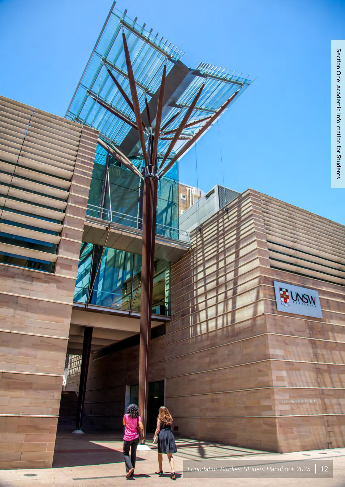
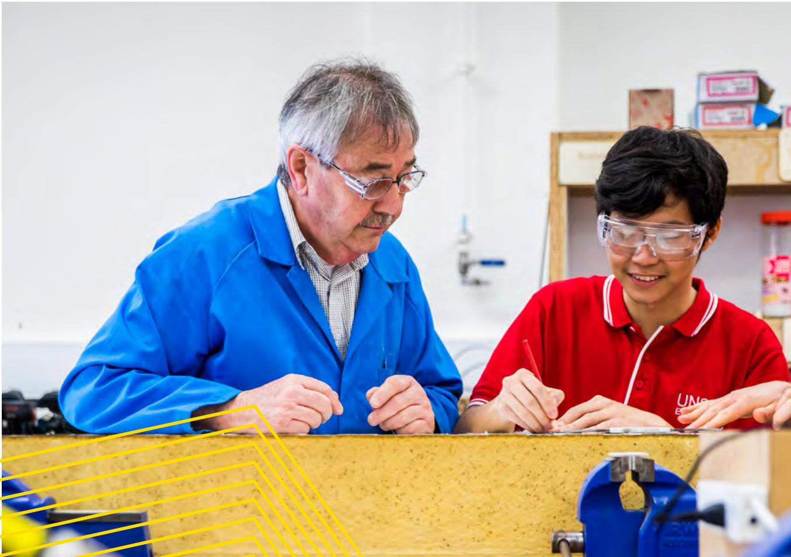
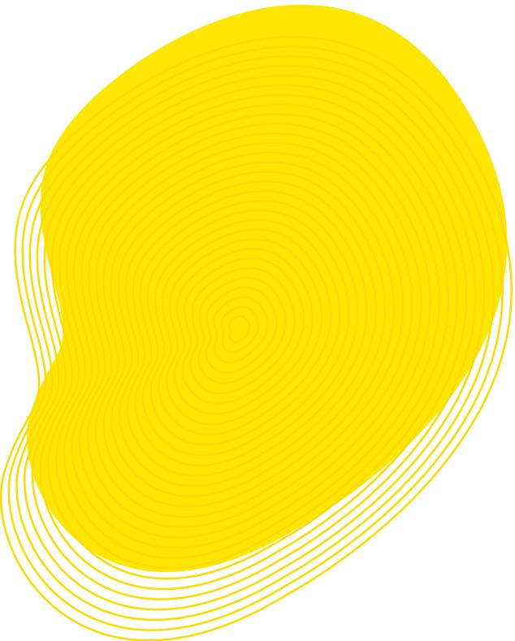
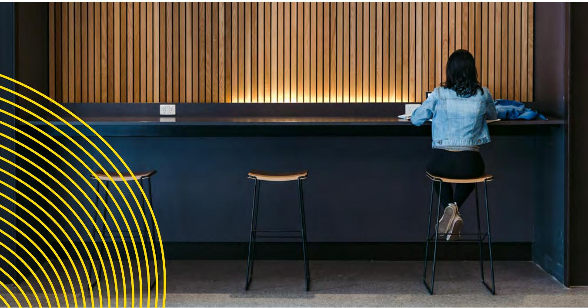
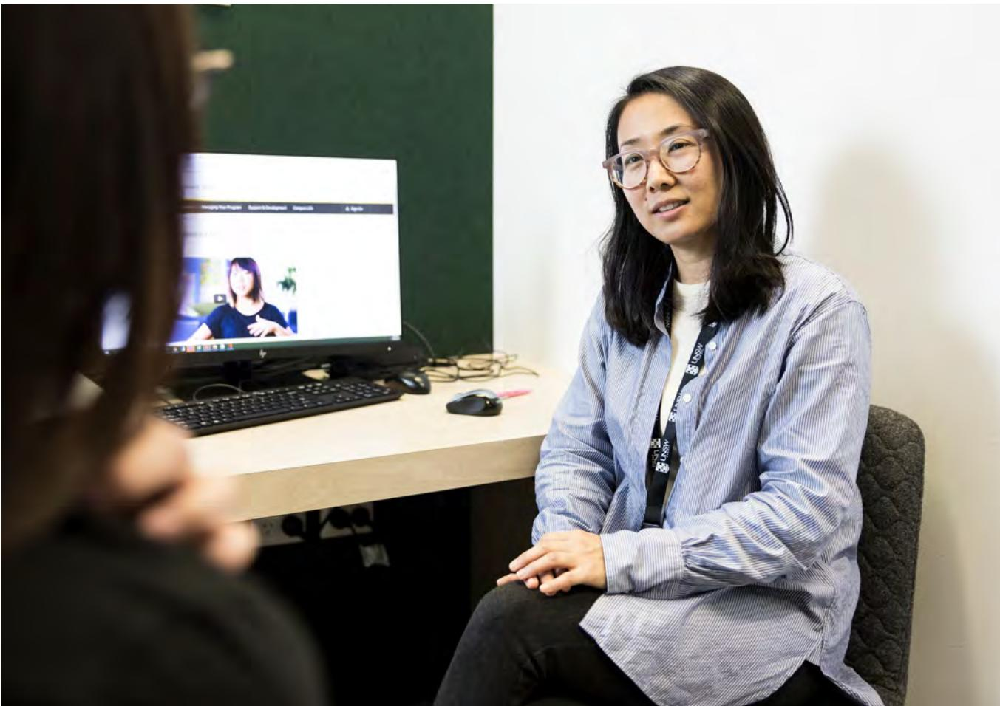
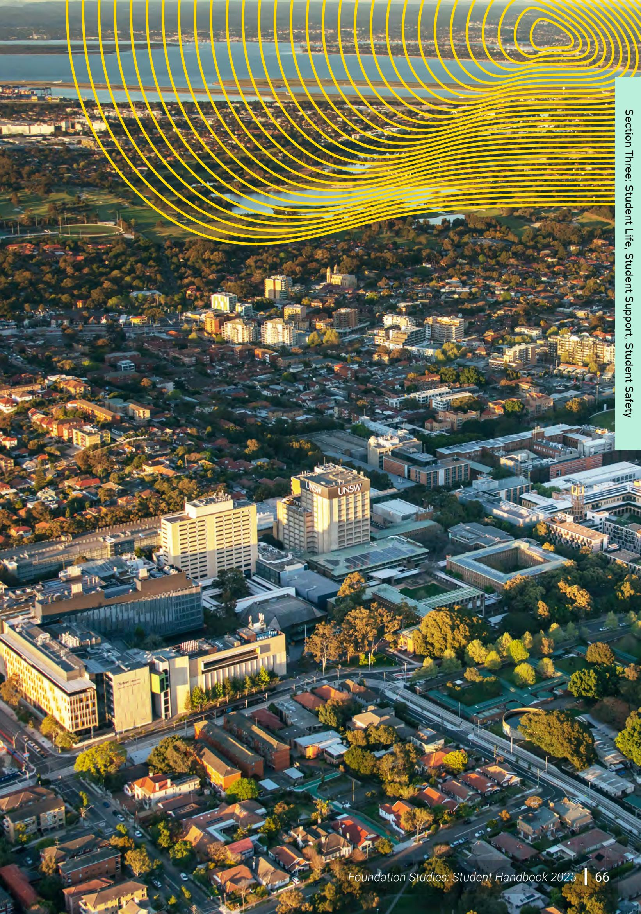

# Foundation Studies

Student Handbook 2025

# UNSW College Foundation Studies

Student Handbook 2025

# -

# Section One

UNSW College

Academic Information for Students

# Building L5, UNSW Sydney Campus, 223 Anzac Parade, Kensington NSW 2033 Australia

T: $+ 6 1$ (2) 8936 2222

W: unswcollege.edu.au

UNSW Global Pty Limited ABN 62 086 418 582 trading as UNSW College". UNSW College CRICOS Provider Code 01020K. UNSW College TEQSA Provider ID: PRV13020 (Institute of Higher Education).

# Section Two

Rules, Regulations & Policies

See unswcollege.edu.au/esos for more information.

$\circledcirc$ 2025 UNSW Global Pty Limited.

All rights reserved. Except under the Conditions described in the Copyright Act 1968 of Australia and subsequent amendments, this publication may not be reproduced, in part or whole, without the permission of the copyright owner.

This publication is revised periodically and is current at the time of printing.

# Section Three

The most recent version of this publication and updated and related policies can be found on the Current Student Hub website: https://my.unswcollege.edu.au/

Student Life, Student Support, Student Safety

# Section One

# Academic Information for Students

1 Foundation Studies Programs, 4 Streams & Courses   
2 Standard Plus Program 7   
3 Standard Program 13   
4 Transition Program 18   
5 Grading System 21   
6 Permanent Resident (PR) & 23 Australian Citizen Status   
7 Minimum Age Policy & Students 24 Under 18 Years of Age   
8 Awards, Scholarships & Course Prizes 25

# Section Two Rules, Regulations & Policies

9 Student Responsibilities 27   
10 Assessment Regulations 31   
11 Satisfactory Academic Progress 35   
12 Academic Misconduct & 39   
Student Misconduct   
13 UNSW Library Guide 42   
14 Submission of Assignments & Projects 43   
15 Practical Assessment in Design 44   
16 Personal Electronic Device Guidelines 45   
17 Use of IT Resources 47   
18 Release of Academic Results 48   
19 Withdrawal & Refund of Fees 49   
20 Attendance Monitoring 49   
21 Change of Stream/Class Requests 51   
22 Repeat & Transfer Guidelines 52   
23 Students Complaints & Appeals Process 54

# Section Three

Student Life, Student Support, Student Safety

24 Student Life 58   
25 Academic Support 61   
26 Student Support (Welfare) 62   
27 Equitable Learning Support 63   
28 Accommodation Support 64   
29 Under 18 Students 65   
30 Student Safety & Emergency Contacts 67

Section One

# Academic Information for Students

# Foundation Studies 1 Programs, Streams & Courses

# Programs

Foundation Studies Programs provide academic preparation for undergraduate study and are designed for international students. The programs are delivered in lecture and tutorial format along with practical laboratory, workshop and studio classes as well as weekly consultations with the instructor. A Student Progress Coordinator will be monitoring student progress and will be able to provide students with individual study advice and tips throughout the duration of their program.

On completion of a Foundation Studies program, students are awarded a Foundation Studies Certificate, which is accepted by UNSW and all Australian universities for undergraduate entry. Academic standards and results in the programs are approved and monitored by UNSW and its Faculties. The Certificate is accompanied by a Statement of Results.

There are three main Foundation Studies programs.

The Standard Foundation Program is delivered over 9 months.

The Standard Plus Foundation Program is delivered over 12 months and designed for students who require a more gradual introduction to their studies.

The Transition Program is a 4-month, one-term program designed for international students who have completed a previous high school matriculation program and have academic results just below that required for direct entry to UNSW.

# Streams and Courses

Within each Foundation Studies Program, students must choose a Stream (set program of courses) determined by their desired university program.

The Transition Program offers the Physical Science, Life Science, Commerce, Design and Actuarial Streams only. Streams and courses at Foundation Studies Kensington campus are shown in Table 1.

All streams contain five to seven courses; each course has a unit of credit weighting. Students usually take a minimum of 48 units of credit.

Table 1: Streams of Study for Students who commenced their standard program study before January 2025.   

<table><tr><td rowspan=2 colspan=2>Streams and Courses</td><td rowspan=1 colspan=2></td><td rowspan=1 colspan=2> Streams of Study</td><td rowspan=1 colspan=2></td></tr><tr><td rowspan=1 colspan=2>Sciences</td><td rowspan=1 colspan=2>Commerce</td><td rowspan=1 colspan=1>Arts</td><td rowspan=1 colspan=1>Design</td></tr><tr><td rowspan=1 colspan=1>Course</td><td rowspan=1 colspan=1>Units</td><td rowspan=1 colspan=1></td><td rowspan=1 colspan=1></td><td rowspan=1 colspan=1></td><td rowspan=1 colspan=1>aaon</td><td rowspan=1 colspan=1>2</td><td rowspan=1 colspan=1>aoaub!saa</td></tr><tr><td rowspan=1 colspan=1>Academic EnglishHumanities</td><td rowspan=1 colspan=1>12</td><td rowspan=1 colspan=1></td><td rowspan=1 colspan=1></td><td rowspan=1 colspan=1></td><td rowspan=1 colspan=1></td><td rowspan=1 colspan=1></td><td rowspan=1 colspan=1></td></tr><tr><td rowspan=1 colspan=1>Academic EnglishScience</td><td rowspan=1 colspan=1>12</td><td rowspan=1 colspan=1>●</td><td rowspan=1 colspan=1></td><td rowspan=1 colspan=1></td><td rowspan=1 colspan=1></td><td rowspan=1 colspan=1></td><td rowspan=1 colspan=1></td></tr><tr><td rowspan=1 colspan=1>Mathematics forScience</td><td rowspan=1 colspan=1>12</td><td rowspan=1 colspan=1></td><td rowspan=1 colspan=1></td><td rowspan=1 colspan=1></td><td rowspan=1 colspan=1></td><td rowspan=1 colspan=1></td><td rowspan=1 colspan=1></td></tr><tr><td rowspan=1 colspan=1>Mathematics forCommerce</td><td rowspan=1 colspan=1>10</td><td rowspan=1 colspan=1></td><td rowspan=1 colspan=1></td><td rowspan=1 colspan=1></td><td rowspan=1 colspan=1></td><td rowspan=1 colspan=1></td><td rowspan=1 colspan=1></td></tr><tr><td rowspan=2 colspan=1>Essentials ofMathematicsStandard Term 1 only</td><td rowspan=1 colspan=1>6</td><td rowspan=2 colspan=1></td><td rowspan=2 colspan=1></td><td rowspan=2 colspan=1></td><td rowspan=2 colspan=1></td><td rowspan=2 colspan=1></td><td rowspan=2 colspan=1></td></tr><tr><td rowspan=1 colspan=1></td></tr><tr><td rowspan=1 colspan=1>Physics</td><td rowspan=1 colspan=1>10</td><td rowspan=1 colspan=1></td><td rowspan=1 colspan=1></td><td rowspan=1 colspan=1></td><td rowspan=1 colspan=1></td><td rowspan=1 colspan=1></td><td rowspan=1 colspan=1></td></tr><tr><td rowspan=1 colspan=1>Chemistry</td><td rowspan=1 colspan=1>10</td><td rowspan=1 colspan=1></td><td rowspan=1 colspan=1></td><td rowspan=1 colspan=1></td><td rowspan=1 colspan=1></td><td rowspan=1 colspan=1></td><td rowspan=1 colspan=1></td></tr><tr><td rowspan=1 colspan=1>Biology</td><td rowspan=1 colspan=1>10</td><td rowspan=1 colspan=1></td><td rowspan=1 colspan=1></td><td rowspan=1 colspan=1></td><td rowspan=1 colspan=1></td><td rowspan=1 colspan=1></td><td rowspan=1 colspan=1></td></tr><tr><td rowspan=1 colspan=1>AccountingStandard Term 1 only</td><td rowspan=1 colspan=1>4</td><td rowspan=1 colspan=1></td><td rowspan=1 colspan=1></td><td rowspan=1 colspan=1></td><td rowspan=1 colspan=1></td><td rowspan=1 colspan=1></td><td rowspan=1 colspan=1></td></tr><tr><td rowspan=1 colspan=1>Computing forScienceStandard only</td><td rowspan=1 colspan=1>4</td><td rowspan=1 colspan=1>●</td><td rowspan=1 colspan=1></td><td rowspan=1 colspan=1></td><td rowspan=1 colspan=1></td><td rowspan=1 colspan=1></td><td rowspan=1 colspan=1></td></tr><tr><td rowspan=1 colspan=1>Computing forBusinessStandard only</td><td rowspan=1 colspan=1></td><td rowspan=1 colspan=1></td><td rowspan=1 colspan=1></td><td rowspan=1 colspan=1></td><td rowspan=1 colspan=1></td><td rowspan=1 colspan=1></td><td rowspan=1 colspan=1></td></tr><tr><td rowspan=1 colspan=1>Computing for Design</td><td rowspan=1 colspan=1>6</td><td rowspan=1 colspan=1></td><td rowspan=1 colspan=1></td><td rowspan=1 colspan=1></td><td rowspan=1 colspan=1></td><td rowspan=1 colspan=1></td><td rowspan=1 colspan=1></td></tr><tr><td rowspan=1 colspan=1>Economics</td><td rowspan=1 colspan=1>10</td><td rowspan=1 colspan=1></td><td rowspan=1 colspan=1></td><td rowspan=1 colspan=1></td><td rowspan=1 colspan=1></td><td rowspan=1 colspan=1></td><td rowspan=1 colspan=1></td></tr><tr><td rowspan=1 colspan=1>Business LawStandard Term 2 only</td><td rowspan=1 colspan=1>4</td><td rowspan=1 colspan=1></td><td rowspan=1 colspan=1></td><td rowspan=1 colspan=1></td><td rowspan=1 colspan=1></td><td rowspan=1 colspan=1></td><td rowspan=1 colspan=1></td></tr><tr><td rowspan=1 colspan=1>Management standardTerm 2 only</td><td rowspan=1 colspan=1>4</td><td rowspan=1 colspan=1></td><td rowspan=1 colspan=1></td><td rowspan=1 colspan=1></td><td rowspan=1 colspan=1></td><td rowspan=1 colspan=1></td><td rowspan=1 colspan=1></td></tr><tr><td rowspan=1 colspan=1>Design</td><td rowspan=1 colspan=1>12</td><td rowspan=1 colspan=1></td><td rowspan=1 colspan=1></td><td rowspan=1 colspan=1></td><td rowspan=1 colspan=1></td><td rowspan=1 colspan=1></td><td rowspan=1 colspan=1></td></tr><tr><td rowspan=1 colspan=1> International Issues &amp;Perspectives</td><td rowspan=1 colspan=1>10</td><td rowspan=1 colspan=1></td><td rowspan=1 colspan=1></td><td rowspan=1 colspan=1></td><td rowspan=1 colspan=1></td><td rowspan=1 colspan=1></td><td rowspan=1 colspan=1></td></tr><tr><td rowspan=1 colspan=1>Culture andCommunication</td><td rowspan=1 colspan=1>12</td><td rowspan=1 colspan=1></td><td rowspan=1 colspan=1></td><td rowspan=1 colspan=1></td><td rowspan=1 colspan=1></td><td rowspan=1 colspan=1></td><td rowspan=1 colspan=1></td></tr><tr><td rowspan=1 colspan=1>Total Units</td><td rowspan=1 colspan=1></td><td rowspan=1 colspan=1>48</td><td rowspan=1 colspan=1>48</td><td rowspan=1 colspan=1>48</td><td rowspan=1 colspan=1>50</td><td rowspan=1 colspan=1>48</td><td rowspan=1 colspan=1>48</td></tr><tr><td rowspan=1 colspan=2>Popular Degree Programs</td><td rowspan=1 colspan=2>Engineering, Science, Medicine,Medical Science,Aviation,OptometryHealth&amp; Exercise Science, BiomedicalSciences, Psychology, Food Scienceand Technology</td><td rowspan=1 colspan=2>Accounting, Finance, Economics,Actuarial tudies,Arts, Social Science,soetaBusiness, Banking and MarketingConstruction Management andProperty</td><td rowspan=1 colspan=1>Arts, some Lawdegrees, Artsand Business,Criminology,Education,&quot;Social Science,InternationalStudies,Languages</td><td rowspan=1 colspan=1>ArchitecturalStudies, Interioror LandscapeArchitecture,IndustrialDesign, MediaArts, Design, ArtTheory, Fine Arts,Planing</td></tr><tr><td></td><td></td><td></td><td></td><td></td><td></td><td rowspan=1 colspan=1></td><td rowspan=1 colspan=1></td></tr></table>

see https://www.unswcollege.edu.au/study/areas-of-study for a fullisting of Streams and Degrees

Table 2: Streams of Study for Students who commenced their standard program study after January 2025.   

<table><tr><td rowspan=2 colspan=2> Streams and Courses</td><td rowspan=1 colspan=2></td><td rowspan=1 colspan=4> Streams of Study</td></tr><tr><td rowspan=1 colspan=2>Sciences</td><td rowspan=1 colspan=2>Commerce</td><td rowspan=1 colspan=1>Arts</td><td rowspan=1 colspan=1>Design</td></tr><tr><td rowspan=1 colspan=1>Course</td><td rowspan=1 colspan=1>Units</td><td rowspan=1 colspan=1>peoissud</td><td rowspan=1 colspan=1>aas an</td><td rowspan=1 colspan=1></td><td rowspan=1 colspan=1>aoauoo</td><td rowspan=1 colspan=1>2</td><td rowspan=1 colspan=1>aoaub!saa</td></tr><tr><td rowspan=1 colspan=1>Academic EnglishHumanities</td><td rowspan=1 colspan=1>12</td><td rowspan=1 colspan=1></td><td rowspan=1 colspan=1></td><td rowspan=1 colspan=1></td><td rowspan=1 colspan=1></td><td rowspan=1 colspan=1></td><td rowspan=1 colspan=1></td></tr><tr><td rowspan=1 colspan=1>Academic EnglishScience</td><td rowspan=1 colspan=1>12</td><td rowspan=1 colspan=1>●</td><td rowspan=1 colspan=1></td><td rowspan=1 colspan=1></td><td rowspan=1 colspan=1></td><td rowspan=1 colspan=1></td><td rowspan=1 colspan=1></td></tr><tr><td rowspan=1 colspan=1>Mathematics forScience</td><td rowspan=1 colspan=1>12</td><td rowspan=1 colspan=1></td><td rowspan=1 colspan=1></td><td rowspan=1 colspan=1></td><td rowspan=1 colspan=1></td><td rowspan=1 colspan=1></td><td rowspan=1 colspan=1></td></tr><tr><td rowspan=1 colspan=1>Mathematics forCommerce</td><td rowspan=1 colspan=1>10</td><td rowspan=1 colspan=1></td><td rowspan=1 colspan=1></td><td rowspan=1 colspan=1></td><td rowspan=1 colspan=1></td><td rowspan=1 colspan=1></td><td rowspan=1 colspan=1></td></tr><tr><td rowspan=1 colspan=1>Essentials ofMathematicsStandard Term 1 only</td><td rowspan=1 colspan=1>6</td><td rowspan=1 colspan=1></td><td rowspan=1 colspan=1></td><td rowspan=1 colspan=1></td><td rowspan=1 colspan=1></td><td rowspan=1 colspan=1></td><td rowspan=1 colspan=1></td></tr><tr><td rowspan=1 colspan=1>Physics</td><td rowspan=1 colspan=1>10</td><td rowspan=1 colspan=1>●</td><td rowspan=1 colspan=1></td><td rowspan=1 colspan=1></td><td rowspan=1 colspan=1></td><td rowspan=1 colspan=1></td><td rowspan=1 colspan=1></td></tr><tr><td rowspan=1 colspan=1>Chemistry</td><td rowspan=1 colspan=1>10</td><td rowspan=1 colspan=1></td><td rowspan=1 colspan=1></td><td rowspan=1 colspan=1></td><td rowspan=1 colspan=1></td><td rowspan=1 colspan=1></td><td rowspan=1 colspan=1></td></tr><tr><td rowspan=1 colspan=1>Biology</td><td rowspan=1 colspan=1>10</td><td rowspan=1 colspan=1></td><td rowspan=1 colspan=1></td><td rowspan=1 colspan=1></td><td rowspan=1 colspan=1></td><td rowspan=1 colspan=1></td><td rowspan=1 colspan=1></td></tr><tr><td rowspan=1 colspan=1>AccountingStandard Term 1 only</td><td rowspan=1 colspan=1>4</td><td rowspan=1 colspan=1></td><td rowspan=1 colspan=1></td><td rowspan=1 colspan=1></td><td rowspan=1 colspan=1></td><td rowspan=1 colspan=1></td><td rowspan=1 colspan=1></td></tr><tr><td rowspan=1 colspan=1>Computing forScienceStandard only</td><td rowspan=1 colspan=1>4</td><td rowspan=1 colspan=1></td><td rowspan=1 colspan=1></td><td rowspan=1 colspan=1></td><td rowspan=1 colspan=1></td><td rowspan=1 colspan=1></td><td rowspan=1 colspan=1></td></tr><tr><td rowspan=1 colspan=1>Computing forBusinessStandard only</td><td rowspan=1 colspan=1></td><td rowspan=1 colspan=1></td><td rowspan=1 colspan=1></td><td rowspan=1 colspan=1></td><td rowspan=1 colspan=1></td><td rowspan=1 colspan=1></td><td rowspan=1 colspan=1></td></tr><tr><td rowspan=1 colspan=1>Computing for Design</td><td rowspan=1 colspan=1>6</td><td rowspan=1 colspan=1></td><td rowspan=1 colspan=1></td><td rowspan=1 colspan=1></td><td rowspan=1 colspan=1></td><td rowspan=1 colspan=1></td><td rowspan=1 colspan=1></td></tr><tr><td rowspan=1 colspan=1>Economics</td><td rowspan=1 colspan=1>10</td><td rowspan=1 colspan=1></td><td rowspan=1 colspan=1></td><td rowspan=1 colspan=1></td><td rowspan=1 colspan=1></td><td rowspan=1 colspan=1></td><td rowspan=1 colspan=1></td></tr><tr><td rowspan=1 colspan=1>Business EnvironmentStandard Term 2 only</td><td rowspan=1 colspan=1>4</td><td rowspan=1 colspan=1></td><td rowspan=1 colspan=1></td><td rowspan=1 colspan=1></td><td rowspan=1 colspan=1></td><td rowspan=1 colspan=1></td><td rowspan=1 colspan=1></td></tr><tr><td rowspan=1 colspan=1>Management standardTerm 2 only</td><td rowspan=1 colspan=1>4</td><td rowspan=1 colspan=1></td><td rowspan=1 colspan=1></td><td rowspan=1 colspan=1></td><td rowspan=1 colspan=1></td><td rowspan=1 colspan=1></td><td rowspan=1 colspan=1></td></tr><tr><td rowspan=1 colspan=1>Design</td><td rowspan=1 colspan=1>12</td><td rowspan=1 colspan=1></td><td rowspan=1 colspan=1></td><td rowspan=1 colspan=1></td><td rowspan=1 colspan=1></td><td rowspan=1 colspan=1></td><td rowspan=1 colspan=1></td></tr><tr><td rowspan=1 colspan=1> International Issues &amp;Perspectives</td><td rowspan=1 colspan=1>10</td><td rowspan=1 colspan=1></td><td rowspan=1 colspan=1></td><td rowspan=1 colspan=1></td><td rowspan=1 colspan=1></td><td rowspan=1 colspan=1></td><td rowspan=1 colspan=1></td></tr><tr><td rowspan=1 colspan=1>Culture andCommunication</td><td rowspan=1 colspan=1>12</td><td rowspan=1 colspan=1></td><td rowspan=1 colspan=1></td><td rowspan=1 colspan=1></td><td rowspan=1 colspan=1></td><td rowspan=1 colspan=1></td><td rowspan=1 colspan=1></td></tr><tr><td rowspan=1 colspan=1>Total Units</td><td rowspan=1 colspan=1></td><td rowspan=1 colspan=1>48</td><td rowspan=1 colspan=1>48</td><td rowspan=1 colspan=1>48</td><td rowspan=1 colspan=1>50</td><td rowspan=1 colspan=1>48</td><td rowspan=1 colspan=1>48</td></tr><tr><td rowspan=1 colspan=2>Popular Degree Programs</td><td rowspan=1 colspan=2>Engineering, Science, Medicine,Medical Science,Aviation,OptometyHealth &amp; Exercise Science, BiomedicalSciences, Psychology, Food Science nd Technology</td><td rowspan=1 colspan=2>Accounting, Finance, EconomicsActuarial Studies,Ats,Social Science,some a degrees, nternationalBusiness,Banking and MarketingConstruction Management and&quot;Property</td><td rowspan=1 colspan=1>Arts, some Lawdegrees, Artsand Business,Criminology,Education,&quot;Social Science,InternationalStudies,Languages</td><td rowspan=1 colspan=1>ArchitecturalStudies, Interioror LandscapeArchitecture,IndustrialDesign, MediaArts, Design, ArtTheory, Fine Arts,Planning</td></tr></table>

;ee https://www.unswcollege.edu.au/study/areas-of-study for a full listing of Streams and Degrees

# 2 Standard Plus Program

Table 3: Standard Plus Program Course Weightings by Term for students who commenced their studies before January 2025.

<table><tr><td rowspan=1 colspan=1>Courses</td><td rowspan=1 colspan=1></td><td rowspan=1 colspan=1>Standard P</td><td rowspan=1 colspan=2> Standard PLUS Program Course Weightings</td></tr><tr><td rowspan=1 colspan=1>Course</td><td rowspan=1 colspan=1>Units</td><td rowspan=1 colspan=1>PLUS Term</td><td rowspan=1 colspan=1>STANDARD Term 1</td><td rowspan=1 colspan=1>STANDARD Term 2</td></tr><tr><td rowspan=1 colspan=1>Academic English forHumanities</td><td rowspan=1 colspan=1>12</td><td rowspan=1 colspan=1>10%</td><td rowspan=1 colspan=1>26.5%</td><td rowspan=1 colspan=1>63.5%</td></tr><tr><td rowspan=1 colspan=1>Academic English for Science</td><td rowspan=1 colspan=1>12</td><td rowspan=1 colspan=1>10%</td><td rowspan=1 colspan=1>26.5%</td><td rowspan=1 colspan=1>63.5%</td></tr><tr><td rowspan=1 colspan=1>Mathematics for Science</td><td rowspan=1 colspan=1>12</td><td rowspan=1 colspan=1>20%</td><td rowspan=1 colspan=1>40%</td><td rowspan=1 colspan=1>40%</td></tr><tr><td rowspan=1 colspan=1> Mathematics for Commerce</td><td rowspan=1 colspan=1>10</td><td rowspan=1 colspan=1>20%</td><td rowspan=1 colspan=1>40%</td><td rowspan=1 colspan=1>40%</td></tr><tr><td rowspan=1 colspan=1>Essentials of MathematicsStandard Term 1 only</td><td rowspan=1 colspan=1>6</td><td rowspan=1 colspan=1></td><td rowspan=1 colspan=1>100%</td><td rowspan=1 colspan=1></td></tr><tr><td rowspan=1 colspan=1>Physics</td><td rowspan=1 colspan=1>10</td><td rowspan=1 colspan=1>10%</td><td rowspan=1 colspan=1>27%</td><td rowspan=1 colspan=1>63%</td></tr><tr><td rowspan=1 colspan=1>Chemistry</td><td rowspan=1 colspan=1>10</td><td rowspan=1 colspan=1>10%</td><td rowspan=1 colspan=1>27%</td><td rowspan=1 colspan=1>63%</td></tr><tr><td rowspan=1 colspan=1>Biology</td><td rowspan=1 colspan=1>10</td><td rowspan=1 colspan=1>10%</td><td rowspan=1 colspan=1>27%</td><td rowspan=1 colspan=1>63%</td></tr><tr><td rowspan=1 colspan=1>AccountingStandard Term 1 only</td><td rowspan=1 colspan=1>4</td><td rowspan=1 colspan=1></td><td rowspan=1 colspan=1>100%</td><td rowspan=1 colspan=1></td></tr><tr><td rowspan=1 colspan=1>Computing for ScienceStandard only</td><td rowspan=1 colspan=1>4</td><td rowspan=1 colspan=1></td><td rowspan=1 colspan=1>50%</td><td rowspan=1 colspan=1>50%</td></tr><tr><td rowspan=1 colspan=1>Computing for BusinessStandard only</td><td rowspan=1 colspan=1>4</td><td rowspan=1 colspan=1></td><td rowspan=1 colspan=1>50%</td><td rowspan=1 colspan=1>50%</td></tr><tr><td rowspan=1 colspan=1>Computing for Design</td><td rowspan=1 colspan=1>6</td><td rowspan=1 colspan=1>10%</td><td rowspan=1 colspan=1>30%</td><td rowspan=1 colspan=1>60%</td></tr><tr><td rowspan=1 colspan=1>Economics</td><td rowspan=1 colspan=1>10</td><td rowspan=1 colspan=1>5%</td><td rowspan=1 colspan=1>50%</td><td rowspan=1 colspan=1>45%</td></tr><tr><td rowspan=1 colspan=1>Business LawStandard Term 2 only</td><td rowspan=1 colspan=1>4</td><td rowspan=1 colspan=1></td><td rowspan=1 colspan=1></td><td rowspan=1 colspan=1>100%</td></tr><tr><td rowspan=1 colspan=1>ManagementStandard Term 2 only</td><td rowspan=1 colspan=1>4</td><td rowspan=1 colspan=1>5%</td><td rowspan=1 colspan=1></td><td rowspan=1 colspan=1>95%</td></tr><tr><td rowspan=1 colspan=1>Design</td><td rowspan=1 colspan=1>12</td><td rowspan=1 colspan=1>10%</td><td rowspan=1 colspan=1>45%</td><td rowspan=1 colspan=1>45%</td></tr><tr><td rowspan=1 colspan=1> International Issues &amp;Perspectives</td><td rowspan=1 colspan=1>10</td><td rowspan=1 colspan=1>5%</td><td rowspan=1 colspan=1>45%</td><td rowspan=1 colspan=1>50%</td></tr><tr><td rowspan=1 colspan=1>Culture &amp; Communication</td><td rowspan=1 colspan=1>12</td><td rowspan=1 colspan=1>10%</td><td rowspan=1 colspan=1>40%</td><td rowspan=1 colspan=1>50%</td></tr></table>

Table 4: Standard Plus Program Course Weightings by Term for students who commenced their studies after January 2025.   

<table><tr><td rowspan=1 colspan=1>Courses</td><td rowspan=1 colspan=1></td><td rowspan=1 colspan=1>Standard P</td><td rowspan=1 colspan=2> Standard PLUS Program Course Weightings</td></tr><tr><td rowspan=1 colspan=1>Course</td><td rowspan=1 colspan=1>Units</td><td rowspan=1 colspan=1>PLUS Term</td><td rowspan=1 colspan=1>STANDARD Term 1</td><td rowspan=1 colspan=1>STANDARD Term 2</td></tr><tr><td rowspan=1 colspan=1>Academic English forHumanities</td><td rowspan=1 colspan=1>12</td><td rowspan=1 colspan=1>10%</td><td rowspan=1 colspan=1>20%</td><td rowspan=1 colspan=1>70%</td></tr><tr><td rowspan=1 colspan=1>Academic English for Science</td><td rowspan=1 colspan=1>12</td><td rowspan=1 colspan=1>10%</td><td rowspan=1 colspan=1>20%</td><td rowspan=1 colspan=1>70%</td></tr><tr><td rowspan=1 colspan=1> Mathematics for Science</td><td rowspan=1 colspan=1>12</td><td rowspan=1 colspan=1>20%</td><td rowspan=1 colspan=1>40%</td><td rowspan=1 colspan=1>40%</td></tr><tr><td rowspan=1 colspan=1> Mathematics for Commerce</td><td rowspan=1 colspan=1>10</td><td rowspan=1 colspan=1>20%</td><td rowspan=1 colspan=1>40%</td><td rowspan=1 colspan=1>40%</td></tr><tr><td rowspan=1 colspan=1>Essentials of MathematicsStandard Term 1 only</td><td rowspan=1 colspan=1>6</td><td rowspan=1 colspan=1></td><td rowspan=1 colspan=1>100%</td><td rowspan=1 colspan=1></td></tr><tr><td rowspan=1 colspan=1>Physics</td><td rowspan=1 colspan=1>10</td><td rowspan=1 colspan=1>10%</td><td rowspan=1 colspan=1>31.5%</td><td rowspan=1 colspan=1>58.5%</td></tr><tr><td rowspan=1 colspan=1>Chemistry</td><td rowspan=1 colspan=1>10</td><td rowspan=1 colspan=1>10%</td><td rowspan=1 colspan=1>31.5%</td><td rowspan=1 colspan=1>58.5%</td></tr><tr><td rowspan=1 colspan=1>Biology</td><td rowspan=1 colspan=1>10</td><td rowspan=1 colspan=1>10%</td><td rowspan=1 colspan=1>31.5%</td><td rowspan=1 colspan=1>58.5%</td></tr><tr><td rowspan=1 colspan=1>AccountingStandard Term 1 only</td><td rowspan=1 colspan=1>4</td><td rowspan=1 colspan=1></td><td rowspan=1 colspan=1>100%</td><td rowspan=1 colspan=1></td></tr><tr><td rowspan=1 colspan=1>Computing for ScienceStandard only</td><td rowspan=1 colspan=1>4</td><td rowspan=1 colspan=1></td><td rowspan=1 colspan=1>50%</td><td rowspan=1 colspan=1>50%</td></tr><tr><td rowspan=1 colspan=1>Computing for BusinessStandard only</td><td rowspan=1 colspan=1>4</td><td rowspan=1 colspan=1></td><td rowspan=1 colspan=1>50%</td><td rowspan=1 colspan=1>50%</td></tr><tr><td rowspan=1 colspan=1>Computing for Design</td><td rowspan=1 colspan=1>6</td><td rowspan=1 colspan=1>10%</td><td rowspan=1 colspan=1>30%</td><td rowspan=1 colspan=1>60%</td></tr><tr><td rowspan=1 colspan=1>Economics</td><td rowspan=1 colspan=1>10</td><td rowspan=1 colspan=1>5%</td><td rowspan=1 colspan=1>50%</td><td rowspan=1 colspan=1>45%</td></tr><tr><td rowspan=1 colspan=1>Business EnvironmentStandard Term 2 only</td><td rowspan=1 colspan=1>4</td><td rowspan=1 colspan=1></td><td rowspan=1 colspan=1></td><td rowspan=1 colspan=1>100%</td></tr><tr><td rowspan=1 colspan=1>ManagementStandard Term 2 only</td><td rowspan=1 colspan=1>4</td><td rowspan=1 colspan=1>5%</td><td rowspan=1 colspan=1></td><td rowspan=1 colspan=1>95%</td></tr><tr><td rowspan=1 colspan=1>Design</td><td rowspan=1 colspan=1>12</td><td rowspan=1 colspan=1>10%</td><td rowspan=1 colspan=1>45%</td><td rowspan=1 colspan=1>45%</td></tr><tr><td rowspan=1 colspan=1>International Issues &amp;Perspectives</td><td rowspan=1 colspan=1>10</td><td rowspan=1 colspan=1>5%</td><td rowspan=1 colspan=1>40%</td><td rowspan=1 colspan=1>55%</td></tr><tr><td rowspan=1 colspan=1>Culture &amp; Communication</td><td rowspan=1 colspan=1>12</td><td rowspan=1 colspan=1>10%</td><td rowspan=1 colspan=1>40%</td><td rowspan=1 colspan=1>50%</td></tr></table>

Table 5: Standard PLUS Program - Terms and Courses   

<table><tr><td rowspan=2 colspan=5>Foundation Studies - Arts and Social Sciences StreamStandard PLUS Program 2025Terms and Course Modules</td></tr><tr><td rowspan=1 colspan=2></td></tr><tr><td rowspan=1 colspan=1>Courses</td><td rowspan=1 colspan=1>Units</td><td rowspan=1 colspan=1>Plus</td><td rowspan=1 colspan=1>Standard Term 1</td><td rowspan=1 colspan=1>Standard Term 2</td></tr><tr><td rowspan=1 colspan=1>Academic English -Humanities (H)</td><td rowspan=1 colspan=1>12</td><td rowspan=1 colspan=1></td><td rowspan=1 colspan=1></td><td rowspan=1 colspan=1></td></tr><tr><td rowspan=1 colspan=1>Computing for Business</td><td rowspan=1 colspan=1>4</td><td rowspan=1 colspan=1></td><td rowspan=1 colspan=1></td><td rowspan=1 colspan=1></td></tr><tr><td rowspan=1 colspan=1>Culture &amp; Communication</td><td rowspan=1 colspan=1>12</td><td rowspan=1 colspan=1>Australian Studies</td><td rowspan=1 colspan=1>International Studies</td><td rowspan=1 colspan=1>Media Studies</td></tr><tr><td rowspan=1 colspan=1>International Issues &amp;Perspectives</td><td rowspan=1 colspan=1>10</td><td rowspan=1 colspan=1></td><td rowspan=1 colspan=1></td><td rowspan=1 colspan=1></td></tr><tr><td rowspan=1 colspan=1>Management</td><td rowspan=1 colspan=1>4</td><td rowspan=1 colspan=1>Critical Skills andCollaboration</td><td rowspan=1 colspan=1></td><td rowspan=1 colspan=1></td></tr><tr><td rowspan=1 colspan=1>Essentials of Mathematics</td><td rowspan=1 colspan=1>6</td><td rowspan=1 colspan=1></td><td rowspan=1 colspan=1></td><td rowspan=1 colspan=1></td></tr><tr><td rowspan=1 colspan=1></td><td rowspan=1 colspan=1>48</td><td rowspan=1 colspan=1></td><td rowspan=1 colspan=1></td><td rowspan=1 colspan=1></td></tr></table>

<table><tr><td rowspan=1 colspan=5>Foundation Studies - Commerce Stream Standard PLUs Program 2025</td></tr><tr><td rowspan=1 colspan=2></td><td rowspan=1 colspan=3>Terms and Course Modules</td></tr><tr><td rowspan=1 colspan=1>Courses</td><td rowspan=1 colspan=1>Units</td><td rowspan=1 colspan=1>Plus</td><td rowspan=1 colspan=1>Standard Term 1</td><td rowspan=1 colspan=1>Standard Term 2</td></tr><tr><td rowspan=1 colspan=1>Academic English -Humanities (H)</td><td rowspan=1 colspan=1>12</td><td rowspan=1 colspan=1></td><td rowspan=1 colspan=1></td><td rowspan=1 colspan=1></td></tr><tr><td rowspan=1 colspan=1>Computing for Business</td><td rowspan=1 colspan=1>4</td><td rowspan=1 colspan=1></td><td rowspan=1 colspan=1></td><td rowspan=1 colspan=1></td></tr><tr><td rowspan=1 colspan=1>Accounting</td><td rowspan=1 colspan=1>4</td><td rowspan=1 colspan=1></td><td rowspan=1 colspan=1></td><td rowspan=1 colspan=1></td></tr><tr><td rowspan=1 colspan=1>Business Law(If you commenced your studies BEFORE January 2025)</td><td rowspan=2 colspan=1>4</td><td rowspan=3 colspan=1></td><td rowspan=3 colspan=1></td><td rowspan=3 colspan=1></td></tr><tr><td rowspan=1 colspan=1>or</td><td rowspan=2 colspan=1>4</td></tr><tr><td rowspan=1 colspan=1>Business Environment(If you commenced your studies AFTER January 2025)</td></tr><tr><td rowspan=1 colspan=1>Economics</td><td rowspan=1 colspan=1>10</td><td rowspan=1 colspan=1>Business Studies</td><td rowspan=1 colspan=1>Microeconomics</td><td rowspan=1 colspan=1>Macroeconomics</td></tr><tr><td rowspan=1 colspan=1>Management</td><td rowspan=1 colspan=1>4</td><td rowspan=1 colspan=1>Critical Skils andCollaboration</td><td rowspan=1 colspan=1></td><td rowspan=1 colspan=1></td></tr><tr><td rowspan=1 colspan=1>Mathematics for Commerce</td><td rowspan=1 colspan=1>10</td><td rowspan=1 colspan=1></td><td rowspan=1 colspan=1></td><td rowspan=1 colspan=1></td></tr><tr><td rowspan=1 colspan=1></td><td rowspan=1 colspan=1>48</td><td rowspan=1 colspan=1></td><td rowspan=1 colspan=1></td><td rowspan=1 colspan=1></td></tr></table>

<table><tr><td rowspan=2 colspan=5>Foundation Studies - Design and Architecture Stream Standard PLUS Program 2025Terms and Course Modules</td></tr><tr><td rowspan=1 colspan=2></td></tr><tr><td rowspan=1 colspan=1>Courses</td><td rowspan=1 colspan=1>Units</td><td rowspan=1 colspan=1>Plus</td><td rowspan=1 colspan=1>Standard Term 1</td><td rowspan=1 colspan=1>Standard Term 2</td></tr><tr><td rowspan=1 colspan=1>Academic English -Humanities (H)</td><td rowspan=1 colspan=1>12</td><td rowspan=1 colspan=1></td><td rowspan=1 colspan=1>●</td><td rowspan=1 colspan=1></td></tr><tr><td rowspan=1 colspan=1>Computing for Design</td><td rowspan=1 colspan=1>6</td><td rowspan=1 colspan=1></td><td rowspan=1 colspan=1></td><td rowspan=1 colspan=1></td></tr><tr><td rowspan=1 colspan=1>Culture &amp; Communication</td><td rowspan=1 colspan=1>12</td><td rowspan=1 colspan=1>Australian Studies</td><td rowspan=1 colspan=1>International Studies</td><td rowspan=1 colspan=1>Media Studies</td></tr><tr><td rowspan=1 colspan=1>Design</td><td rowspan=1 colspan=1>12</td><td rowspan=1 colspan=1>●</td><td rowspan=1 colspan=1></td><td rowspan=1 colspan=1></td></tr><tr><td rowspan=1 colspan=1>Essentials of Mathematics</td><td rowspan=1 colspan=1>6</td><td rowspan=1 colspan=1></td><td rowspan=1 colspan=1></td><td rowspan=1 colspan=1></td></tr><tr><td rowspan=1 colspan=1></td><td rowspan=1 colspan=1>48</td><td rowspan=1 colspan=1></td><td rowspan=1 colspan=1></td><td rowspan=1 colspan=1></td></tr></table>

<table><tr><td colspan="7" rowspan="1">Foundation Studies - Commerce Actuarial StreamStandard PLUS Program 2025</td></tr><tr><td colspan="2" rowspan="1"></td><td colspan="5" rowspan="1">Terms and Course Modules</td></tr><tr><td colspan="1" rowspan="1">Courses</td><td colspan="1" rowspan="1">Units</td><td colspan="1" rowspan="1">Plus</td><td colspan="1" rowspan="1">Standard Term 1</td><td colspan="3" rowspan="1">Standard Term 2</td></tr><tr><td colspan="1" rowspan="1">Academic English -Humanities (H)</td><td colspan="1" rowspan="1">12</td><td colspan="1" rowspan="1"></td><td colspan="1" rowspan="1"></td><td colspan="3" rowspan="1"></td></tr><tr><td colspan="1" rowspan="1">Computing for Business</td><td colspan="1" rowspan="1">4</td><td colspan="1" rowspan="1"></td><td colspan="1" rowspan="1"></td><td colspan="3" rowspan="1"></td></tr><tr><td colspan="1" rowspan="1">Accounting</td><td colspan="1" rowspan="1">4</td><td colspan="1" rowspan="1"></td><td colspan="1" rowspan="1"></td><td colspan="3" rowspan="1"></td></tr><tr><td colspan="1" rowspan="1">Business Law(If you commenced yourstudies BEFORE January 2025)</td><td colspan="1" rowspan="1"></td><td colspan="1" rowspan="3"></td><td colspan="1" rowspan="3"></td><td colspan="3" rowspan="3"></td></tr><tr><td colspan="1" rowspan="1">or</td><td colspan="3" rowspan="1">4</td></tr><tr><td colspan="1" rowspan="1">Business Environment(If you commenced yourstudies AFTER January 2025)</td><td colspan="3" rowspan="1"></td></tr><tr><td colspan="1" rowspan="1">Economics</td><td colspan="1" rowspan="1">10</td><td colspan="1" rowspan="1">Business Studies</td><td colspan="1" rowspan="1">Microeconomics</td><td colspan="3" rowspan="1">Macroeconomics</td></tr><tr><td colspan="1" rowspan="1">Management</td><td colspan="1" rowspan="1">4</td><td colspan="1" rowspan="1">Critical Skills andCollaboration</td><td colspan="1" rowspan="1"></td><td colspan="3" rowspan="1"></td></tr><tr><td colspan="1" rowspan="1"> Mathematics for Science</td><td colspan="1" rowspan="1">12</td><td colspan="1" rowspan="1"></td><td colspan="1" rowspan="1"></td><td colspan="3" rowspan="1"></td></tr><tr><td colspan="1" rowspan="1"></td><td colspan="1" rowspan="1">50</td><td colspan="1" rowspan="1"></td><td colspan="1" rowspan="1"></td><td colspan="3" rowspan="1"></td></tr><tr><td colspan="5" rowspan="2">Foundation Studies - Physical Science Stream Standard PLUs Program 2025Terms and Course Modules</td></tr><tr><td colspan="2" rowspan="1"></td></tr><tr><td colspan="1" rowspan="1">Courses</td><td colspan="1" rowspan="1">Units</td><td colspan="1" rowspan="1">Plus</td><td colspan="1" rowspan="1">Standard Term 1</td><td colspan="1" rowspan="1">Standard Term 2</td></tr><tr><td colspan="1" rowspan="1">Academic English -Science (S)</td><td colspan="1" rowspan="1">12</td><td colspan="1" rowspan="1"></td><td colspan="1" rowspan="1"></td><td colspan="1" rowspan="1"></td></tr><tr><td colspan="1" rowspan="1">Computing for Science</td><td colspan="1" rowspan="1">4</td><td colspan="1" rowspan="1"></td><td colspan="1" rowspan="1"></td><td colspan="1" rowspan="1"></td></tr><tr><td colspan="1" rowspan="1">Chemistry</td><td colspan="1" rowspan="1">10</td><td colspan="1" rowspan="1"></td><td colspan="1" rowspan="1"></td><td colspan="1" rowspan="1"></td></tr><tr><td colspan="1" rowspan="1">Physics</td><td colspan="1" rowspan="1">10</td><td colspan="1" rowspan="1"></td><td colspan="1" rowspan="1"></td><td colspan="1" rowspan="1"></td></tr><tr><td colspan="1" rowspan="1"> Mathematics for Science</td><td colspan="1" rowspan="1">12</td><td colspan="1" rowspan="1"></td><td colspan="1" rowspan="1"></td><td colspan="1" rowspan="1"></td></tr><tr><td colspan="1" rowspan="1"></td><td colspan="1" rowspan="1">48</td><td colspan="1" rowspan="1"></td><td colspan="1" rowspan="1"></td><td colspan="1" rowspan="1"></td></tr></table>

<table><tr><td rowspan=1 colspan=5>Foundation Studies - Life Science StreamStandard PLUS Program 2025</td></tr><tr><td rowspan=1 colspan=1></td><td rowspan=1 colspan=1></td><td rowspan=1 colspan=3>Terms and Course Modules</td></tr><tr><td rowspan=1 colspan=1>Courses</td><td rowspan=1 colspan=1>Units</td><td rowspan=1 colspan=1>Plus</td><td rowspan=1 colspan=1>Standard Term 1</td><td rowspan=1 colspan=1>Standard Term 2</td></tr><tr><td rowspan=1 colspan=1>Academic English -Science (S)</td><td rowspan=1 colspan=1>12</td><td rowspan=1 colspan=1></td><td rowspan=1 colspan=1></td><td rowspan=1 colspan=1></td></tr><tr><td rowspan=1 colspan=1>Computing for Science</td><td rowspan=1 colspan=1>4</td><td rowspan=1 colspan=1></td><td rowspan=1 colspan=1></td><td rowspan=1 colspan=1></td></tr><tr><td rowspan=1 colspan=1>Chemistry</td><td rowspan=1 colspan=1>10</td><td rowspan=1 colspan=1></td><td rowspan=1 colspan=1></td><td rowspan=1 colspan=1></td></tr><tr><td rowspan=1 colspan=1>Biology</td><td rowspan=1 colspan=1>10</td><td rowspan=1 colspan=1></td><td rowspan=1 colspan=1></td><td rowspan=1 colspan=1></td></tr><tr><td rowspan=1 colspan=1> Mathematics for Science</td><td rowspan=1 colspan=1>12</td><td rowspan=1 colspan=1></td><td rowspan=1 colspan=1></td><td rowspan=1 colspan=1></td></tr><tr><td rowspan=1 colspan=1></td><td rowspan=1 colspan=1>48</td><td rowspan=1 colspan=1></td><td rowspan=1 colspan=1></td><td rowspan=1 colspan=1></td></tr></table>

# 3 Standard Program

Table 6: Standard Program Course Weightings by Term for students who commenced their studies before March 2025.   

<table><tr><td rowspan=1 colspan=1>Courses</td><td rowspan=1 colspan=1></td><td rowspan=1 colspan=2> STANDARD Program Course Weighting</td></tr><tr><td rowspan=1 colspan=1>Course</td><td rowspan=1 colspan=1>Units</td><td rowspan=1 colspan=1>STANDARDTerm 1</td><td rowspan=1 colspan=1>STANDARDTerm 2</td></tr><tr><td rowspan=1 colspan=1>Academic English forHumanities</td><td rowspan=1 colspan=1>12</td><td rowspan=1 colspan=1>34%</td><td rowspan=1 colspan=1>66%</td></tr><tr><td rowspan=1 colspan=1>Academic English forScience</td><td rowspan=1 colspan=1>12</td><td rowspan=1 colspan=1>34%</td><td rowspan=1 colspan=1>66%</td></tr><tr><td rowspan=1 colspan=1> Mathematics for Science</td><td rowspan=1 colspan=1>12</td><td rowspan=1 colspan=1>50%</td><td rowspan=1 colspan=1>50%</td></tr><tr><td rowspan=1 colspan=1>Mathematics forCommerce</td><td rowspan=1 colspan=1>10</td><td rowspan=1 colspan=1>50%</td><td rowspan=1 colspan=1>50%</td></tr><tr><td rowspan=1 colspan=1>Essentials ofMathematicsStandard Term 1 only</td><td rowspan=1 colspan=1>6</td><td rowspan=1 colspan=1>100%</td><td rowspan=1 colspan=1></td></tr><tr><td rowspan=1 colspan=1>Physics</td><td rowspan=1 colspan=1>10</td><td rowspan=1 colspan=1>30%</td><td rowspan=1 colspan=1>70%</td></tr><tr><td rowspan=1 colspan=1>Chemistry</td><td rowspan=1 colspan=1>10</td><td rowspan=1 colspan=1>30%</td><td rowspan=1 colspan=1>70%</td></tr><tr><td rowspan=1 colspan=1>Biology</td><td rowspan=1 colspan=1>10</td><td rowspan=1 colspan=1>30%</td><td rowspan=1 colspan=1>70%</td></tr><tr><td rowspan=1 colspan=1>AccountingStandard Term 1 only</td><td rowspan=1 colspan=1>4</td><td rowspan=1 colspan=1>100%</td><td rowspan=1 colspan=1></td></tr><tr><td rowspan=1 colspan=1>Computing for ScienceStandard only</td><td rowspan=1 colspan=1>4</td><td rowspan=1 colspan=1>50%</td><td rowspan=1 colspan=1>50%</td></tr><tr><td rowspan=1 colspan=1>Computing for BusinessStandard only</td><td rowspan=1 colspan=1>4</td><td rowspan=1 colspan=1>50%</td><td rowspan=1 colspan=1>50%</td></tr><tr><td rowspan=1 colspan=1>Computing for Design</td><td rowspan=1 colspan=1>6</td><td rowspan=1 colspan=1>50%</td><td rowspan=1 colspan=1>50%</td></tr><tr><td rowspan=1 colspan=1>Economics</td><td rowspan=1 colspan=1>10</td><td rowspan=1 colspan=1>50%</td><td rowspan=1 colspan=1>50%</td></tr><tr><td rowspan=1 colspan=1>Business LawStandard Term 2 only</td><td rowspan=1 colspan=1>4</td><td rowspan=1 colspan=1></td><td rowspan=1 colspan=1>100%</td></tr><tr><td rowspan=1 colspan=1>ManagementStandard Term 2 only</td><td rowspan=1 colspan=1>4</td><td rowspan=1 colspan=1></td><td rowspan=1 colspan=1>100%</td></tr><tr><td rowspan=1 colspan=1>Design</td><td rowspan=1 colspan=1>12</td><td rowspan=1 colspan=1>50%</td><td rowspan=1 colspan=1>50%</td></tr><tr><td rowspan=1 colspan=1> International Issues &amp;Perspectives</td><td rowspan=1 colspan=1>10</td><td rowspan=1 colspan=1>50%</td><td rowspan=1 colspan=1>50%</td></tr><tr><td rowspan=1 colspan=1>Culture &amp;Communication</td><td rowspan=1 colspan=1>12</td><td rowspan=1 colspan=1>50%</td><td rowspan=1 colspan=1>50%</td></tr></table>

Table 7: Standard Program Course Weightings by Term for students who commenced their studies after March 2025.   

<table><tr><td rowspan=1 colspan=1>Courses</td><td rowspan=1 colspan=1></td><td rowspan=1 colspan=2> STANDARD Program Course Weighting</td></tr><tr><td rowspan=1 colspan=1>Course</td><td rowspan=1 colspan=1>Units</td><td rowspan=1 colspan=1>STANDARDTerm 1</td><td rowspan=1 colspan=1>STANDARDTerm 2</td></tr><tr><td rowspan=1 colspan=1>Academic English forHumanities</td><td rowspan=1 colspan=1>12</td><td rowspan=1 colspan=1>30%</td><td rowspan=1 colspan=1>70%</td></tr><tr><td rowspan=1 colspan=1>Academic English forScience</td><td rowspan=1 colspan=1>12</td><td rowspan=1 colspan=1>30%</td><td rowspan=1 colspan=1>70%</td></tr><tr><td rowspan=1 colspan=1> Mathematics for Science</td><td rowspan=1 colspan=1>12</td><td rowspan=1 colspan=1>50%</td><td rowspan=1 colspan=1>50%</td></tr><tr><td rowspan=1 colspan=1>Mathematics forCommerce</td><td rowspan=1 colspan=1>10</td><td rowspan=1 colspan=1>50%</td><td rowspan=1 colspan=1>50%</td></tr><tr><td rowspan=1 colspan=1>Essentials ofMathematicsStandard Term 1 only</td><td rowspan=1 colspan=1>6</td><td rowspan=1 colspan=1>100%</td><td rowspan=1 colspan=1></td></tr><tr><td rowspan=1 colspan=1>Physics</td><td rowspan=1 colspan=1>10</td><td rowspan=1 colspan=1>35%</td><td rowspan=1 colspan=1>65%</td></tr><tr><td rowspan=1 colspan=1>Chemistry</td><td rowspan=1 colspan=1>10</td><td rowspan=1 colspan=1>35%</td><td rowspan=1 colspan=1>65%</td></tr><tr><td rowspan=1 colspan=1>Biology</td><td rowspan=1 colspan=1>10</td><td rowspan=1 colspan=1>35%</td><td rowspan=1 colspan=1>65%</td></tr><tr><td rowspan=1 colspan=1>AccountingStandard Term 1 only</td><td rowspan=1 colspan=1>4</td><td rowspan=1 colspan=1>100%</td><td rowspan=1 colspan=1></td></tr><tr><td rowspan=1 colspan=1>Computing for ScienceStandard only</td><td rowspan=1 colspan=1>4</td><td rowspan=1 colspan=1>50%</td><td rowspan=1 colspan=1>50%</td></tr><tr><td rowspan=1 colspan=1>Computing for BusinessStandard only</td><td rowspan=1 colspan=1>4</td><td rowspan=1 colspan=1>50%</td><td rowspan=1 colspan=1>50%</td></tr><tr><td rowspan=1 colspan=1>Computing for Design</td><td rowspan=1 colspan=1>6</td><td rowspan=1 colspan=1>30%</td><td rowspan=1 colspan=1>70%</td></tr><tr><td rowspan=1 colspan=1>Economics</td><td rowspan=1 colspan=1>10</td><td rowspan=1 colspan=1>50%</td><td rowspan=1 colspan=1>50%</td></tr><tr><td rowspan=1 colspan=1>Business EnvironmentStandard Term 2 only</td><td rowspan=1 colspan=1>4</td><td rowspan=1 colspan=1></td><td rowspan=1 colspan=1>100%</td></tr><tr><td rowspan=1 colspan=1>ManagementStandard Term 2 only</td><td rowspan=1 colspan=1>4</td><td rowspan=1 colspan=1></td><td rowspan=1 colspan=1>100%</td></tr><tr><td rowspan=1 colspan=1>Design</td><td rowspan=1 colspan=1>12</td><td rowspan=1 colspan=1>50%</td><td rowspan=1 colspan=1>50%</td></tr><tr><td rowspan=1 colspan=1> International Issues &amp;Perspectives</td><td rowspan=1 colspan=1>10</td><td rowspan=1 colspan=1>45%</td><td rowspan=1 colspan=1>55%</td></tr><tr><td rowspan=1 colspan=1>Culture &amp;Communication</td><td rowspan=1 colspan=1>12</td><td rowspan=1 colspan=1>50%</td><td rowspan=1 colspan=1>50%</td></tr></table>

Table 8: Standard Program - Terms and Courses   

<table><tr><td rowspan=1 colspan=4>Foundation Studies - Arts and Social Sciences Stream Standard Program 2025</td></tr><tr><td rowspan=1 colspan=2></td><td rowspan=1 colspan=2>Terms and Course Modules</td></tr><tr><td rowspan=1 colspan=1>Courses</td><td rowspan=1 colspan=1>Units</td><td rowspan=1 colspan=1>Standard Term 1</td><td rowspan=1 colspan=1>Standard Term 2</td></tr><tr><td rowspan=1 colspan=1>Academic English -Humanities (H)</td><td rowspan=1 colspan=1>12</td><td rowspan=1 colspan=1></td><td rowspan=1 colspan=1></td></tr><tr><td rowspan=1 colspan=1>Computing for Business</td><td rowspan=1 colspan=1>4</td><td rowspan=1 colspan=1>●</td><td rowspan=1 colspan=1></td></tr><tr><td rowspan=1 colspan=1>Culture &amp;Communication</td><td rowspan=1 colspan=1>12</td><td rowspan=1 colspan=1>Intercultural Studies</td><td rowspan=1 colspan=1>Media Studies</td></tr><tr><td rowspan=1 colspan=1> International Issues &amp;Perspectives</td><td rowspan=1 colspan=1>10</td><td rowspan=1 colspan=1></td><td rowspan=1 colspan=1></td></tr><tr><td rowspan=1 colspan=1>Management</td><td rowspan=1 colspan=1>4</td><td rowspan=1 colspan=1>●</td><td rowspan=1 colspan=1></td></tr><tr><td rowspan=1 colspan=1>Essentials ofMathematics</td><td rowspan=1 colspan=1>6</td><td rowspan=1 colspan=1></td><td rowspan=1 colspan=1></td></tr><tr><td rowspan=1 colspan=1></td><td rowspan=1 colspan=1>48</td><td rowspan=1 colspan=1></td><td rowspan=1 colspan=1></td></tr></table>

<table><tr><td rowspan=1 colspan=4> Foundation Studies - Design and Architecture Stream Standard Program 2025</td></tr><tr><td rowspan=1 colspan=2></td><td rowspan=1 colspan=2>Terms and Course Modules</td></tr><tr><td rowspan=1 colspan=1>Courses</td><td rowspan=1 colspan=1>Units</td><td rowspan=1 colspan=1>Standard Term 1</td><td rowspan=1 colspan=1>Standard Term 2</td></tr><tr><td rowspan=1 colspan=1>Academic English -Humanities (H)</td><td rowspan=1 colspan=1>12</td><td rowspan=1 colspan=1></td><td rowspan=1 colspan=1></td></tr><tr><td rowspan=1 colspan=1>Computing for Design</td><td rowspan=1 colspan=1>6</td><td rowspan=1 colspan=1></td><td rowspan=1 colspan=1></td></tr><tr><td rowspan=1 colspan=1>Culture &amp;Communication</td><td rowspan=1 colspan=1>12</td><td rowspan=1 colspan=1>●Intercultural Studies</td><td rowspan=1 colspan=1>Media Studies</td></tr><tr><td rowspan=1 colspan=1>Design</td><td rowspan=1 colspan=1>12</td><td rowspan=1 colspan=1></td><td rowspan=1 colspan=1></td></tr><tr><td rowspan=1 colspan=1>Essentials ofMathematics</td><td rowspan=1 colspan=1>6</td><td rowspan=1 colspan=1>●</td><td rowspan=1 colspan=1></td></tr><tr><td rowspan=1 colspan=1></td><td rowspan=1 colspan=1>48</td><td rowspan=1 colspan=1></td><td rowspan=1 colspan=1></td></tr></table>

<table><tr><td rowspan=1 colspan=5>Foundation Studies - Commerce Stream Standard Program 2025</td></tr><tr><td rowspan=1 colspan=3></td><td rowspan=1 colspan=2>Terms and Course Modules</td></tr><tr><td rowspan=1 colspan=1>Courses</td><td rowspan=1 colspan=2>Units</td><td rowspan=1 colspan=1>Standard Term 1</td><td rowspan=1 colspan=1>Standard Term 2</td></tr><tr><td rowspan=1 colspan=1>Academic English -Humanities (H)</td><td rowspan=1 colspan=2>12</td><td rowspan=1 colspan=1></td><td rowspan=1 colspan=1></td></tr><tr><td rowspan=1 colspan=1>Computing for Business</td><td rowspan=1 colspan=2>4</td><td rowspan=1 colspan=1></td><td rowspan=1 colspan=1></td></tr><tr><td rowspan=1 colspan=1>Accounting</td><td rowspan=1 colspan=2>4</td><td rowspan=1 colspan=1></td><td rowspan=1 colspan=1></td></tr><tr><td rowspan=1 colspan=1>Business Law(If you commenced yourstudies BEFORE March2025)</td><td rowspan=1 colspan=2></td><td rowspan=3 colspan=1></td><td rowspan=3 colspan=1></td></tr><tr><td rowspan=1 colspan=1>or</td><td rowspan=1 colspan=1></td><td rowspan=2 colspan=1>4</td></tr><tr><td rowspan=1 colspan=1>Business Environment(If you commenced yourstudies AFTER March2025)</td><td></td></tr><tr><td rowspan=1 colspan=1>Economics</td><td rowspan=1 colspan=2>10</td><td rowspan=1 colspan=1>Microeconomics</td><td rowspan=1 colspan=1>Macroeconomics</td></tr><tr><td rowspan=1 colspan=1>Management</td><td rowspan=1 colspan=2>4</td><td rowspan=1 colspan=1></td><td rowspan=1 colspan=1></td></tr><tr><td rowspan=1 colspan=1>Mathematics forCommerce</td><td rowspan=1 colspan=2>10</td><td rowspan=1 colspan=1>●</td><td rowspan=1 colspan=1></td></tr><tr><td rowspan=1 colspan=1></td><td rowspan=1 colspan=2>48</td><td rowspan=1 colspan=1></td><td rowspan=1 colspan=1></td></tr></table>

<table><tr><td colspan="4" rowspan="1">Foundation Studies - Commerce Actuarial StreamStandard Program 2025</td></tr><tr><td colspan="2" rowspan="1"></td><td colspan="2" rowspan="1">Terms and Course Modules</td></tr><tr><td colspan="1" rowspan="1">Courses</td><td colspan="1" rowspan="1">Units</td><td colspan="1" rowspan="1">Standard Term 1</td><td colspan="1" rowspan="1">Standard Term 2</td></tr><tr><td colspan="1" rowspan="1">Academic English -Humanities (H)</td><td colspan="1" rowspan="1">12</td><td colspan="1" rowspan="1"></td><td colspan="1" rowspan="1"></td></tr><tr><td colspan="1" rowspan="1">Computing for Business</td><td colspan="1" rowspan="1">4</td><td colspan="1" rowspan="1"></td><td colspan="1" rowspan="1"></td></tr><tr><td colspan="1" rowspan="1">Accounting</td><td colspan="1" rowspan="1">4</td><td colspan="1" rowspan="1"></td><td colspan="1" rowspan="1"></td></tr><tr><td colspan="1" rowspan="1">Business Law(If you commenced yourstudies BEFORE March2025)</td><td colspan="1" rowspan="3">4</td><td colspan="1" rowspan="3"></td><td colspan="1" rowspan="3"></td></tr><tr><td colspan="1" rowspan="1">or</td></tr><tr><td colspan="1" rowspan="1">Business Environment(If you commenced yourstudies AFTER March2025)</td></tr><tr><td colspan="1" rowspan="1">Economics</td><td colspan="1" rowspan="1">10</td><td colspan="1" rowspan="1">Microeconomics</td><td colspan="1" rowspan="1">Macroeconomics</td></tr><tr><td colspan="1" rowspan="1">Management</td><td colspan="1" rowspan="1">4</td><td colspan="1" rowspan="1"></td><td colspan="1" rowspan="1"></td></tr><tr><td colspan="1" rowspan="1">Mathematics for Science</td><td colspan="1" rowspan="1">12</td><td colspan="1" rowspan="1"></td><td colspan="1" rowspan="1"></td></tr><tr><td colspan="1" rowspan="1"></td><td colspan="1" rowspan="1">50</td><td colspan="1" rowspan="1"></td><td colspan="1" rowspan="1"></td></tr><tr><td colspan="4" rowspan="1">Foundation Studies - Physical Science Stream Standard Program 2025</td></tr><tr><td colspan="2" rowspan="1"></td><td colspan="2" rowspan="1">Terms and Course Modules</td></tr><tr><td colspan="1" rowspan="1">Courses</td><td colspan="1" rowspan="1">Units</td><td colspan="1" rowspan="1">Standard Term 1</td><td colspan="1" rowspan="1">Standard Term 2</td></tr><tr><td colspan="1" rowspan="1">Academic English -Science (S)</td><td colspan="1" rowspan="1">12</td><td colspan="1" rowspan="1"></td><td colspan="1" rowspan="1"></td></tr><tr><td colspan="1" rowspan="1">Computing for Science</td><td colspan="1" rowspan="1">4</td><td colspan="1" rowspan="1"></td><td colspan="1" rowspan="1"></td></tr><tr><td colspan="1" rowspan="1">Chemistry</td><td colspan="1" rowspan="1">10</td><td colspan="1" rowspan="1"></td><td colspan="1" rowspan="1"></td></tr><tr><td colspan="1" rowspan="1">Physics</td><td colspan="1" rowspan="1">10</td><td colspan="1" rowspan="1"></td><td colspan="1" rowspan="1"></td></tr><tr><td colspan="1" rowspan="1"> Mathematics for Science</td><td colspan="1" rowspan="1">12</td><td colspan="1" rowspan="1"></td><td colspan="1" rowspan="1"></td></tr><tr><td colspan="1" rowspan="1"></td><td colspan="1" rowspan="1">48</td><td colspan="1" rowspan="1"></td><td colspan="1" rowspan="1"></td></tr></table>

<table><tr><td rowspan=1 colspan=4> Foundation Studies - Life Science Stream Standard Program 2025</td></tr><tr><td rowspan=1 colspan=2></td><td rowspan=1 colspan=2>Terms and Course Modules</td></tr><tr><td rowspan=1 colspan=1>Courses</td><td rowspan=1 colspan=1>Units</td><td rowspan=1 colspan=1>Standard Term 1</td><td rowspan=1 colspan=1>Standard Term 2</td></tr><tr><td rowspan=1 colspan=1>Academic English -Science (S)</td><td rowspan=1 colspan=1>12</td><td rowspan=1 colspan=1></td><td rowspan=1 colspan=1></td></tr><tr><td rowspan=1 colspan=1>Computing for Science</td><td rowspan=1 colspan=1>4</td><td rowspan=1 colspan=1></td><td rowspan=1 colspan=1></td></tr><tr><td rowspan=1 colspan=1>Chemistry</td><td rowspan=1 colspan=1>10</td><td rowspan=1 colspan=1></td><td rowspan=1 colspan=1></td></tr><tr><td rowspan=1 colspan=1>Biology</td><td rowspan=1 colspan=1>10</td><td rowspan=1 colspan=1></td><td rowspan=1 colspan=1></td></tr><tr><td rowspan=1 colspan=1> Mathematics for Science</td><td rowspan=1 colspan=1>12</td><td rowspan=1 colspan=1></td><td rowspan=1 colspan=1></td></tr><tr><td rowspan=1 colspan=1></td><td rowspan=1 colspan=1>48</td><td rowspan=1 colspan=1></td><td rowspan=1 colspan=1></td></tr></table>

# 4 Transition Program

The Foundation Studies Transition Program is a one-semester program, designed for international students with strong English skils (IELTS score of 6.0 or greater) and Academic results just below that required for direct university entry.

Upon successful completion of the T2 and T3 programs, a student can begin undergraduate studies at the beginning of the following year. The next available UNSW intake for T1 students is the Mid-Year intake (UNSW Session 2). Some university programs are not offered Mid-Year.

Only Physical Science, Life Science, Commerce, Commerce Actuarial and Design streams are offered in the Transition program. These core streams of study willallow entry to all UNSW undergraduate degrees.

Table 9: Course Assessment Components and Weighting $\%$ of total assessment)   

<table><tr><td rowspan=1 colspan=1>Courses</td><td rowspan=1 colspan=1></td><td rowspan=1 colspan=4>Transition Program Course Weightings</td><td rowspan=1 colspan=1></td></tr><tr><td rowspan=1 colspan=1>Course</td><td rowspan=1 colspan=1>Units</td><td rowspan=1 colspan=1>FinalExamination</td><td rowspan=1 colspan=1>Mid programExamination/ChallengeActivity</td><td rowspan=1 colspan=1>Essays/Assignments</td><td rowspan=1 colspan=1>TutorialParticipation</td><td rowspan=1 colspan=1>Lab or StudioPractice</td></tr><tr><td rowspan=1 colspan=1>Academic English</td><td rowspan=1 colspan=1>10</td><td rowspan=1 colspan=1>45%</td><td rowspan=1 colspan=1>15%</td><td rowspan=1 colspan=1>30%</td><td rowspan=1 colspan=1>10%</td><td rowspan=1 colspan=1></td></tr><tr><td rowspan=1 colspan=1>Mathematics forScience</td><td rowspan=1 colspan=1>12</td><td rowspan=1 colspan=1>60%</td><td rowspan=1 colspan=1>40%</td><td rowspan=1 colspan=1></td><td rowspan=1 colspan=1></td><td rowspan=1 colspan=1></td></tr><tr><td rowspan=1 colspan=1>Mathematics forCommerce</td><td rowspan=1 colspan=1>10</td><td rowspan=1 colspan=1>60%</td><td rowspan=1 colspan=1>40%</td><td rowspan=1 colspan=1></td><td rowspan=1 colspan=1></td><td rowspan=1 colspan=1></td></tr><tr><td rowspan=1 colspan=1>Economics</td><td rowspan=1 colspan=1>6</td><td rowspan=1 colspan=1>60%</td><td rowspan=1 colspan=1>15%</td><td rowspan=1 colspan=1>15%</td><td rowspan=1 colspan=1>10%</td><td rowspan=1 colspan=1></td></tr><tr><td rowspan=1 colspan=1>Accounting</td><td rowspan=1 colspan=1>6</td><td rowspan=1 colspan=1>60%</td><td rowspan=1 colspan=1>15%</td><td rowspan=1 colspan=1>15%</td><td rowspan=1 colspan=1>10%</td><td rowspan=1 colspan=1></td></tr><tr><td rowspan=1 colspan=1>Business Law</td><td rowspan=1 colspan=1>6</td><td rowspan=1 colspan=1>60%</td><td rowspan=1 colspan=1>10%</td><td rowspan=1 colspan=1>20%</td><td rowspan=1 colspan=1>10%</td><td rowspan=1 colspan=1></td></tr><tr><td rowspan=1 colspan=1>Computing forBusiness</td><td rowspan=1 colspan=1>4</td><td rowspan=1 colspan=1>50%</td><td rowspan=1 colspan=1>40%</td><td rowspan=1 colspan=1></td><td rowspan=1 colspan=1>10%</td><td rowspan=1 colspan=1></td></tr><tr><td rowspan=1 colspan=1>Computing forScience</td><td rowspan=1 colspan=1>4</td><td rowspan=1 colspan=1>50%</td><td rowspan=1 colspan=1>40%</td><td rowspan=1 colspan=1></td><td rowspan=1 colspan=1>10%</td><td rowspan=1 colspan=1></td></tr><tr><td rowspan=1 colspan=1>Computing forDesign</td><td rowspan=1 colspan=1>10</td><td rowspan=1 colspan=1></td><td rowspan=1 colspan=1></td><td rowspan=1 colspan=1>100%</td><td rowspan=1 colspan=1></td><td rowspan=1 colspan=1></td></tr><tr><td rowspan=1 colspan=1>Chemistry, Biology&amp; Physics</td><td rowspan=1 colspan=1>11</td><td rowspan=1 colspan=1>40%</td><td rowspan=1 colspan=1>30%</td><td rowspan=1 colspan=1></td><td rowspan=1 colspan=1></td><td rowspan=1 colspan=1>30%</td></tr><tr><td rowspan=1 colspan=1>Design</td><td rowspan=1 colspan=1>22</td><td rowspan=1 colspan=1></td><td rowspan=1 colspan=1>15%</td><td rowspan=1 colspan=1>85%</td><td rowspan=1 colspan=1></td><td rowspan=1 colspan=1></td></tr><tr><td rowspan=1 colspan=1>Management</td><td rowspan=1 colspan=1>6</td><td rowspan=1 colspan=1>30%</td><td rowspan=1 colspan=1>20%</td><td rowspan=1 colspan=1>30%</td><td rowspan=1 colspan=1>20%</td><td rowspan=1 colspan=1></td></tr></table>

<table><tr><td rowspan=1 colspan=1></td><td rowspan=1 colspan=4>Foundation Studies - Commerce StreamTransition Program 2025</td><td rowspan=1 colspan=1></td></tr><tr><td rowspan=1 colspan=1>Courses</td><td rowspan=1 colspan=1>Units</td><td rowspan=1 colspan=1>FinalExamination</td><td rowspan=1 colspan=1>Mid programExamination/ChallengeActivity</td><td rowspan=1 colspan=1>Essays/Assignments</td><td rowspan=1 colspan=1>TutorialParticipation</td></tr><tr><td rowspan=1 colspan=1>Academic English</td><td rowspan=1 colspan=1>10</td><td rowspan=1 colspan=1>45%</td><td rowspan=1 colspan=1>15%</td><td rowspan=1 colspan=1>30%</td><td rowspan=1 colspan=1>10%</td></tr><tr><td rowspan=1 colspan=1>Mathematics forCommerce</td><td rowspan=1 colspan=1>10</td><td rowspan=1 colspan=1>60%</td><td rowspan=1 colspan=1>40%</td><td rowspan=1 colspan=1></td><td rowspan=1 colspan=1></td></tr><tr><td rowspan=1 colspan=1>Economics</td><td rowspan=1 colspan=1>6</td><td rowspan=1 colspan=1>60%</td><td rowspan=1 colspan=1>15%</td><td rowspan=1 colspan=1>15%</td><td rowspan=1 colspan=1>10%</td></tr><tr><td rowspan=1 colspan=1>Accounting</td><td rowspan=1 colspan=1>6</td><td rowspan=1 colspan=1>60%</td><td rowspan=1 colspan=1>15%</td><td rowspan=1 colspan=1>15%</td><td rowspan=1 colspan=1>10%</td></tr><tr><td rowspan=1 colspan=1>Business Law</td><td rowspan=1 colspan=1>6</td><td rowspan=1 colspan=1>60%</td><td rowspan=1 colspan=1>10%</td><td rowspan=1 colspan=1>20%</td><td rowspan=1 colspan=1>10%</td></tr><tr><td rowspan=1 colspan=1>Computing for Business</td><td rowspan=1 colspan=1>4</td><td rowspan=1 colspan=1>50%</td><td rowspan=1 colspan=1>40%</td><td rowspan=1 colspan=1></td><td rowspan=1 colspan=1>10%</td></tr><tr><td rowspan=1 colspan=1>Management</td><td rowspan=1 colspan=1>6</td><td rowspan=1 colspan=1>30%</td><td rowspan=1 colspan=1>20%</td><td rowspan=1 colspan=1>30%</td><td rowspan=1 colspan=1>20%</td></tr><tr><td rowspan=1 colspan=1></td><td rowspan=1 colspan=1>48</td><td rowspan=1 colspan=1></td><td rowspan=1 colspan=1></td><td rowspan=1 colspan=1></td><td rowspan=1 colspan=1></td></tr></table>

<table><tr><td rowspan=1 colspan=6>Foundation Studies - Commerce Actuarial StreamTransition Program 2025</td></tr><tr><td rowspan=1 colspan=1>Courses</td><td rowspan=1 colspan=1>Units</td><td rowspan=1 colspan=1>FinalExamination</td><td rowspan=1 colspan=1>Mid programExamination/ChallengeActivity</td><td rowspan=1 colspan=1>Essays/Assignments</td><td rowspan=1 colspan=1>TutorialParticipation</td></tr><tr><td rowspan=1 colspan=1>Academic English</td><td rowspan=1 colspan=1>10</td><td rowspan=1 colspan=1>45%</td><td rowspan=1 colspan=1>15%</td><td rowspan=1 colspan=1>30%</td><td rowspan=1 colspan=1>10%</td></tr><tr><td rowspan=1 colspan=1>Mathematics forCommerce</td><td rowspan=1 colspan=1>12</td><td rowspan=1 colspan=1>60%</td><td rowspan=1 colspan=1>40%</td><td rowspan=1 colspan=1></td><td rowspan=1 colspan=1></td></tr><tr><td rowspan=1 colspan=1>Economics</td><td rowspan=1 colspan=1>6</td><td rowspan=1 colspan=1>60%</td><td rowspan=1 colspan=1>15%</td><td rowspan=1 colspan=1>15%</td><td rowspan=1 colspan=1>10%</td></tr><tr><td rowspan=1 colspan=1>Accounting</td><td rowspan=1 colspan=1>6</td><td rowspan=1 colspan=1>60%</td><td rowspan=1 colspan=1>15%</td><td rowspan=1 colspan=1>15%</td><td rowspan=1 colspan=1>10%</td></tr><tr><td rowspan=1 colspan=1>Business Law</td><td rowspan=1 colspan=1>6</td><td rowspan=1 colspan=1>60%</td><td rowspan=1 colspan=1>10%</td><td rowspan=1 colspan=1>20%</td><td rowspan=1 colspan=1>10%</td></tr><tr><td rowspan=1 colspan=1>Computing for Business</td><td rowspan=1 colspan=1>4</td><td rowspan=1 colspan=1>50%</td><td rowspan=1 colspan=1>40%</td><td rowspan=1 colspan=1></td><td rowspan=1 colspan=1>10%</td></tr><tr><td rowspan=1 colspan=1>Management</td><td rowspan=1 colspan=1>6</td><td rowspan=1 colspan=1>30%</td><td rowspan=1 colspan=1>20%</td><td rowspan=1 colspan=1>30%</td><td rowspan=1 colspan=1>20%</td></tr><tr><td rowspan=1 colspan=1></td><td rowspan=1 colspan=1>48</td><td rowspan=1 colspan=1></td><td rowspan=1 colspan=1></td><td rowspan=1 colspan=1></td><td rowspan=1 colspan=1></td></tr></table>

<table><tr><td rowspan=1 colspan=5>Foundation Studies – Design and Architecture StreamTransition Program 2025</td><td rowspan=1 colspan=1></td></tr><tr><td rowspan=1 colspan=1>Courses</td><td rowspan=1 colspan=1>Units</td><td rowspan=1 colspan=1>FinalExamination</td><td rowspan=1 colspan=1>Mid programExamination/ChallengeActivity</td><td rowspan=1 colspan=1>Essays/Assignments</td><td rowspan=1 colspan=1>TutorialParticipation</td></tr><tr><td rowspan=1 colspan=1>Academic English</td><td rowspan=1 colspan=1>10</td><td rowspan=1 colspan=1>45%</td><td rowspan=1 colspan=1>15%</td><td rowspan=1 colspan=1>30%</td><td rowspan=1 colspan=1>10%</td></tr><tr><td rowspan=1 colspan=1>Computing for Design</td><td rowspan=1 colspan=1>10</td><td rowspan=1 colspan=1></td><td rowspan=1 colspan=1></td><td rowspan=1 colspan=1>100%</td><td rowspan=1 colspan=1></td></tr><tr><td rowspan=1 colspan=1>Design</td><td rowspan=1 colspan=1>22</td><td rowspan=1 colspan=1></td><td rowspan=1 colspan=1>15%</td><td rowspan=1 colspan=1>85%</td><td rowspan=1 colspan=1></td></tr><tr><td rowspan=1 colspan=1>Management</td><td rowspan=1 colspan=1>6</td><td rowspan=1 colspan=1>30%</td><td rowspan=1 colspan=1>20%</td><td rowspan=1 colspan=1>30%</td><td rowspan=1 colspan=1>20%</td></tr><tr><td rowspan=1 colspan=1></td><td rowspan=1 colspan=1>48</td><td rowspan=1 colspan=1></td><td rowspan=1 colspan=1></td><td rowspan=1 colspan=1></td><td rowspan=1 colspan=1></td></tr></table>

<table><tr><td rowspan=1 colspan=1></td><td rowspan=1 colspan=4>Foundation Studies – Physical Science Stream Transition Program 2025</td><td rowspan=1 colspan=1></td><td rowspan=1 colspan=1></td></tr><tr><td rowspan=1 colspan=1>Courses</td><td rowspan=1 colspan=1>Units</td><td rowspan=1 colspan=1>FinalExamination</td><td rowspan=1 colspan=1>Mid programExamination/ChallengeActivity</td><td rowspan=1 colspan=1>Essays/Assignments</td><td rowspan=1 colspan=1>TutorialParticipation</td><td rowspan=1 colspan=1>Lab or StudioPractice</td></tr><tr><td rowspan=1 colspan=1>Academic English</td><td rowspan=1 colspan=1>10</td><td rowspan=1 colspan=1>45%</td><td rowspan=1 colspan=1>15%</td><td rowspan=1 colspan=1>30%</td><td rowspan=1 colspan=1>10%</td><td rowspan=1 colspan=1></td></tr><tr><td rowspan=1 colspan=1>Mathematics forScience</td><td rowspan=1 colspan=1>12</td><td rowspan=1 colspan=1>60%</td><td rowspan=1 colspan=1>40%</td><td rowspan=1 colspan=1></td><td rowspan=1 colspan=1></td><td rowspan=1 colspan=1></td></tr><tr><td rowspan=1 colspan=1>Computing forScience</td><td rowspan=1 colspan=1>4</td><td rowspan=1 colspan=1>50%</td><td rowspan=1 colspan=1>40%</td><td rowspan=1 colspan=1></td><td rowspan=1 colspan=1>10%</td><td rowspan=1 colspan=1></td></tr><tr><td rowspan=1 colspan=1>Chemistry</td><td rowspan=1 colspan=1>11</td><td rowspan=1 colspan=1>40%</td><td rowspan=1 colspan=1>30%</td><td rowspan=1 colspan=1></td><td rowspan=1 colspan=1></td><td rowspan=1 colspan=1>30%</td></tr><tr><td rowspan=1 colspan=1>Physics</td><td rowspan=1 colspan=1>11</td><td rowspan=1 colspan=1>40%</td><td rowspan=1 colspan=1>30%</td><td rowspan=1 colspan=1></td><td rowspan=1 colspan=1></td><td rowspan=1 colspan=1>30%</td></tr><tr><td rowspan=1 colspan=1></td><td rowspan=1 colspan=1>48</td><td rowspan=1 colspan=1></td><td rowspan=1 colspan=1></td><td rowspan=1 colspan=1></td><td rowspan=1 colspan=1></td><td rowspan=1 colspan=1></td></tr></table>

<table><tr><td rowspan=1 colspan=1></td><td rowspan=1 colspan=1></td><td rowspan=1 colspan=3>Foundation Studies – Life Science Stream Transition Program 2025</td><td rowspan=1 colspan=1></td><td rowspan=1 colspan=1></td></tr><tr><td rowspan=1 colspan=1>Courses</td><td rowspan=1 colspan=1>Units</td><td rowspan=1 colspan=1>FinalExamination</td><td rowspan=1 colspan=1>Mid programExamination/ChallengeActivity</td><td rowspan=1 colspan=1>Essays/Assignments</td><td rowspan=1 colspan=1>TutorialParticipation</td><td rowspan=1 colspan=1>Lab or StudioPractice</td></tr><tr><td rowspan=1 colspan=1>Academic English</td><td rowspan=1 colspan=1>10</td><td rowspan=1 colspan=1>45%</td><td rowspan=1 colspan=1>15%</td><td rowspan=1 colspan=1>30%</td><td rowspan=1 colspan=1>10%</td><td rowspan=1 colspan=1></td></tr><tr><td rowspan=1 colspan=1>Mathematics forScience</td><td rowspan=1 colspan=1>12</td><td rowspan=1 colspan=1>60%</td><td rowspan=1 colspan=1>40%</td><td rowspan=1 colspan=1></td><td rowspan=1 colspan=1></td><td rowspan=1 colspan=1></td></tr><tr><td rowspan=1 colspan=1>Computing forScience</td><td rowspan=1 colspan=1>4</td><td rowspan=1 colspan=1>50%</td><td rowspan=1 colspan=1>40%</td><td rowspan=1 colspan=1></td><td rowspan=1 colspan=1>10%</td><td rowspan=1 colspan=1></td></tr><tr><td rowspan=1 colspan=1>Chemistry</td><td rowspan=1 colspan=1>11</td><td rowspan=1 colspan=1>50%</td><td rowspan=1 colspan=1>30%</td><td rowspan=1 colspan=1></td><td rowspan=1 colspan=1></td><td rowspan=1 colspan=1>20%</td></tr><tr><td rowspan=1 colspan=1>Biology</td><td rowspan=1 colspan=1>11</td><td rowspan=1 colspan=1>50%</td><td rowspan=1 colspan=1>30%</td><td rowspan=1 colspan=1></td><td rowspan=1 colspan=1></td><td rowspan=1 colspan=1>20%</td></tr><tr><td rowspan=1 colspan=1></td><td rowspan=1 colspan=1>48</td><td rowspan=1 colspan=1></td><td rowspan=1 colspan=1></td><td rowspan=1 colspan=1></td><td rowspan=1 colspan=1></td><td rowspan=1 colspan=1></td></tr></table>

# 5 Grading System

# Grading System

Students in each course are allocated afinal mark out of 100 and a corresponding final ltter grade on an A to F scale. Each leter grade has an associated grade point on a 10-point scale. Overall performance is expressed as a weighted grade point average (GPA) out of 10, based on all units attempted.

Course grades are described in Table 10 below. A typical GPA calculation is shown in Table 11.

Table 10: Foundation Studies Grades (examples are a guide only)   

<table><tr><td rowspan=1 colspan=1>Course Grade</td><td rowspan=1 colspan=1>Grade Point</td><td rowspan=1 colspan=1>Description</td><td rowspan=1 colspan=1> Examples of UNsW undergraduate programentry with GPA at this level(International Students Only)</td></tr><tr><td rowspan=1 colspan=1>A+</td><td rowspan=1 colspan=1>10.0</td><td rowspan=3 colspan=1>Excellent achievement</td><td rowspan=3 colspan=1>UNSW Medicine (with other requirements)</td></tr><tr><td rowspan=1 colspan=1>A</td><td rowspan=1 colspan=1>9.5</td></tr><tr><td rowspan=1 colspan=1>A-</td><td rowspan=1 colspan=1>9.0</td></tr><tr><td rowspan=1 colspan=1>B+</td><td rowspan=1 colspan=1>8.5</td><td rowspan=2 colspan=1>Very good achievement</td><td rowspan=1 colspan=1>UNSW Law</td></tr><tr><td rowspan=1 colspan=1>B</td><td rowspan=1 colspan=1>8.0</td><td rowspan=1 colspan=1>UNSW Commerce, Architecture, Engineering</td></tr><tr><td rowspan=1 colspan=1>B-</td><td rowspan=1 colspan=1>7.5</td><td rowspan=1 colspan=1></td><td rowspan=1 colspan=1>UNSW Science, Advanced Science</td></tr><tr><td rowspan=1 colspan=1>C+</td><td rowspan=1 colspan=1>7.0</td><td rowspan=1 colspan=1>Good achievement</td><td rowspan=1 colspan=1>UNSW Diploma in Engineering, UNSW Arts &amp;Social Science, College of Fine Arts</td></tr><tr><td rowspan=1 colspan=1>C</td><td rowspan=1 colspan=1>6.5</td><td rowspan=2 colspan=1>Moderate achievement</td><td rowspan=1 colspan=1>UNSW Diploma in Science</td></tr><tr><td rowspan=1 colspan=1>C-</td><td rowspan=1 colspan=1>6.0</td><td rowspan=1 colspan=1>Some Australian undergraduate programs</td></tr><tr><td rowspan=1 colspan=1>D+</td><td rowspan=1 colspan=1>5.5</td><td rowspan=3 colspan=1>Marginal achievement</td><td rowspan=3 colspan=1>Some vocational certificate courses</td></tr><tr><td rowspan=1 colspan=1>D</td><td rowspan=1 colspan=1>5.0</td></tr><tr><td rowspan=1 colspan=1>D-</td><td rowspan=1 colspan=1>4.5</td></tr><tr><td rowspan=1 colspan=1>E+</td><td rowspan=1 colspan=1>4.0</td><td rowspan=3 colspan=1>Limited achievement</td><td rowspan=3 colspan=1></td></tr><tr><td rowspan=1 colspan=1>E</td><td rowspan=1 colspan=1>3.5</td></tr><tr><td rowspan=1 colspan=1>E-</td><td rowspan=1 colspan=1>3.0</td></tr><tr><td rowspan=1 colspan=1>F</td><td rowspan=1 colspan=1>0</td><td rowspan=1 colspan=1>Fail</td><td rowspan=1 colspan=1></td></tr><tr><td rowspan=1 colspan=1>UF</td><td rowspan=1 colspan=1>0</td><td rowspan=1 colspan=1>Unsatisfactory – Failure</td><td rowspan=1 colspan=1>Normally due to a non-attempt in asignificant assessment component of acourse</td></tr><tr><td rowspan=1 colspan=1>NF</td><td rowspan=1 colspan=1>N/A</td><td rowspan=1 colspan=1>Withdrawn without Failure</td><td rowspan=1 colspan=1></td></tr><tr><td rowspan=1 colspan=1>W</td><td rowspan=1 colspan=1>N/A</td><td rowspan=1 colspan=1>Withheld</td><td rowspan=1 colspan=1></td></tr></table>

# Table 11: Grade-Point-Average Calculation

A typical GPA calculation is shown for a student in the Commerce Stream.

<table><tr><td rowspan=1 colspan=1>Course Grade</td><td rowspan=1 colspan=1>Unit Weighting</td><td rowspan=1 colspan=1>Final Grade</td><td rowspan=1 colspan=1>Grade Points</td><td rowspan=2 colspan=2></td></tr><tr><td rowspan=1 colspan=1>Academic English</td><td rowspan=1 colspan=1>12</td><td rowspan=1 colspan=1>B</td><td rowspan=1 colspan=1>12×8=96</td></tr><tr><td rowspan=1 colspan=1>Mathematics C</td><td rowspan=1 colspan=1>10</td><td rowspan=1 colspan=1>B+</td><td rowspan=1 colspan=1>10×8.5= 85</td><td rowspan=2 colspan=2>GPA = Totalpoints earned</td></tr><tr><td rowspan=1 colspan=1>Economics</td><td rowspan=1 colspan=1>10</td><td rowspan=1 colspan=1>A</td><td rowspan=1 colspan=1>10×9.5= 95</td></tr><tr><td rowspan=1 colspan=1>Business Law</td><td rowspan=1 colspan=1>4</td><td rowspan=1 colspan=1>B-</td><td rowspan=1 colspan=1>4×7.5=30</td><td rowspan=3 colspan=2>divided by (÷)the total units:382÷48= 8.0</td></tr><tr><td rowspan=1 colspan=1>Accounting</td><td rowspan=1 colspan=1>4</td><td rowspan=1 colspan=1>C+</td><td rowspan=1 colspan=1>4x7=28</td></tr><tr><td rowspan=1 colspan=1>Computingfor AcademicPurposes</td><td rowspan=1 colspan=1>4</td><td rowspan=1 colspan=1>C</td><td rowspan=1 colspan=1>4×6.5= 26</td></tr><tr><td rowspan=1 colspan=1>Management</td><td rowspan=1 colspan=1>4</td><td rowspan=1 colspan=1>D+</td><td rowspan=1 colspan=1>4x5.5 = 22</td><td rowspan=2 colspan=2></td></tr><tr><td rowspan=1 colspan=1>Total Units</td><td rowspan=1 colspan=1>48</td><td rowspan=1 colspan=1></td><td rowspan=1 colspan=1>382</td></tr></table>

# Permanent Resident (PR) & 6 Australian Citizen Status

# Permanent Resident (PR) and Australian Citizen Status

All students should check the UNSW website to confirm their undergraduate degree will commence in time for the completion of their Foundation Studies program as on some occasions there may be term delay between the completion of Foundation Studies and commencement of an undergraduate program.

Students who have Permanent Resident (PR) or Australian citizen status can complete a Foundation Studies program. Foundation Studies policies, rules and regulations apply to all students irespective of their nationality or residency status. The normal tuition fee applies.

Students who change their status from that of international student to PR or Australian citizen, must notify the UNSW College Student Enquiries Office and also the Student Wellbeing Advisers immediately. Failure to do so may affect university admission.

Based on the Foundation Studies results, PR and Australian Citizen students may apply for a university place. Application is made through the Universities Admissions Centre (UAC), along with all other Australian citizens sitting final exams such as the NSW Higher School Certificate. Entry levels that apply for New Year and Mid-Year entry are determined by UAC at the time of each intake and are dependent on the availability of places. The GPA requirements for UNsW may be higher and sometimes lower than that of international students for some programs. The Student Wellbeing Advisers wil hold meetings to advise PR and Australian Citizens of the procedures for admission to university through UAC.

Please note that some universities will only accept the Foundation Studies Certificate for entry from international, non-resident students.

The University of New South Wales accepts the Foundation Studies Certificate for entry from international students and Australian Citizens or Australian Permanent Residents.

Please note that in some Faculties, there are NO Commonwealth Supported Places - CSP (previously known as HECS places) available for students in Term 2 or 3 because they have all been allocated to students in the Term 1 intake.

Not all UNSW undergraduate programs are offered in Terms 2 and 3.

# Minimum Age Policy & 7 Students Under 18 Years of Age

# Minimum Age Policy

Foundation Studies has a policy with regard to the minimum age of students accepted into the program, for the issue of provisional offers to UNsW and the approval of care and welfare arrangements. This policy is as follows:

Foundation Studies will not accept students   
unless they will be at least 16 years of age at the commencement date of their Foundation Studies program.   
This policy would also apply to external   
campuses conducting Foundation Studies   
programs.

# Students Under 18 Years of Age

For international students, it is a condition of their student visa to either:

1. Reside with a parent or close relative over 21 years of age who has been approved by the Department of Home Affairs (DHA) as their carer/guardian or   
2. To have their care, accommodation and welfare arrangements approved by Foundation Studies.

Under 18 students, who have been issued with CAAW by UNSW College must follow a set of rules to ensure their safety and wellbeing. For more information, refer to Section 3 Under 18 Students in the handbook on page 63.

# 8 Awards, Scholarships & Course Prizes

Standard and Standard Plus students at the Kensington campus compete for the same awards, scholarships and course prizes. Scholarships, awards and prizes are awarded automatically. No application form is required.

# Outstanding Student Awards

A total of three dux awards are made each year to the Outstanding Student (all Programs) in each academic area:

Commerce   
Arts/Design   
Physical/Life Science

These awards are for the best academic performance across all Plus and Standard Foundation Studies Programs at the Kensington campus.

Further, the annual dux of each academic area is recognised on the Foundation Studies Outstanding Student Honour Roll.

# Ross Woodham Scholarships

A total of 9 Ross Woodham Scholarships are awarded annually.

Scholarship selection will be based on academic performance upon completion of the Program. The Scholarships will be awarded to Kensington campus students who:

1. achieve the best academic performance in the Foundation Studies streams of:

Commerce   
Arts/Design   
Physical/Life Science

and

2. take up an undergraduate program of study at UNSW.

The Scholarships are currently to the value of AUDS10,000, payable to UNsW to offset student fees for international students in the second term of their undergraduate program, or in the form of a one-off payment for living expenses for permanent residents or Australian Citizens.

# Course Prizes

Course prizes are awarded to Kensington campus students for the best academic performance in each course across the A, B and C Standard/Standard Plus Programs. Course Prizes take the form of Certificates and University Bookshop gift vouchers.

# Presentations

All A, B and C Standard/Standard Plus/Program awards are presented at the next UNSW Foundation End-of-Program Celebration.

All award, scholarship and prize winners will be notified and invited to attend the End-of-Program Celebration.

# Other UNSW Scholarships

From time to time, UNSW offers scholarships to Foundation Studies on completion of their program. For more details and information on how to apply, please look at the UNSW Website https://www.scholarships.unsw.edu.au/

# Rules, Regulations & Policies

# Student 9 Responsibilities

# Follow the UNSW College Student Code of Conduct

The UNSW College Student Code of Conduct serves as a guide to help all students understand the expectations for their behavior whilst enrolled at the College.

It outlines the standards for academic integrity, respect for others, and the consequences for actions that go against these principles.

Here are the key purposes:

Promote a positive learning environment. The code ensures that everyone in the school community can learn and work in a safe, respectful, and supportive atmosphere.

# Define Acceptable Behaviour.

It clearly states what is considered appropriate and inappropriate behavior, helping students know how to act responsibly and respectfully towards others.

Protect the Rights of All Students. By setting out rules, the code helps protect students from discrimination, harassment, bulling, and other forms of misconduct.

Encourage Responsibility and Accountability. It teaches students to take responsibility for their actions and understand the consequences of breaking the rules.

# Support Academic Integrity.

The code includes guidelines on academic honesty, such as prohibiting cheating or plagiarism, to ensure fairness and integrity in academic work.

By understanding and following the Student Code of Conduct, students can contribute to a positive and productive College experience.

Read the UNSW College Student Code of Conduct here

# Check Your UNSW Student Email Daily

UNSW and UNSW College communicate with students via email. Official communication with students will always be via their UNsW student email account. UNSW College will use the student's official GID email address to contact them.

It is the student's responsibility to check their official UNSW student email account regularly for important information. Ignorance is no excuse if relevant information and details have been sent to them by email, or handed out at lectures or on the website.

# Provide Your Current Address Details

Students must inform us within 7 days of their arrival in Australia of their correct residential address and phone contact details and must advise any later changes of address or contact details within 7 days. This is a condition of their student visa.

Students must do this online at https://my.unswcollege.edu.au/ and click on the link to the Student Portal. Important information may be sent by mail to their official address in Australia, and it will be assumed that they have received this information.

# Attend All Scheduled Classes

It is a condition of students' enrolment that they attend all scheduled classes, except where there is a legitimate and acceptable reason for non-attendance e.g., illness supported by a Doctor's Certificate (see Section 2 Chapter 20). Overseas students whose attendance regularly falls below $90 \%$ (even with Doctor's Certificates) may be reported to the Department of Home Affairs.

# Missing Classes – Explanation of Absence

If students miss between 1 – 5 days of classes, they must complete an Explanation of Absence form while informing their teacher. The form is located on the Forms page of the Current Student Hub website: https://my.unswcollege.edu.au/forms

Students are required to submit the form with an official medical certificate, or other official documentation recognised as Compassionate or Compelling evidence. All supporting documentation must be in English or translated into English by a certified translator.

If illness is the cause of absence, medical certificates must be provided from a local health provider who is AHPRA registered. Overseas medical certificates will not be accepted. A copy of the policy can be found on UNSW College's website under 'Policies'. Students may also refer to the Student Guide for Special Consideration, located in the Appeals section here: https://my.unswcollege.edu.au/forms/.

By submitting this form, a student's attendance record will not be adjusted. However, these forms will be taken into consideration if the attendance falls below $80 \%$ and the College is required to issue a notifi cation of 'Intention to Report' to the government.

# Extended Absence – Leave of Absence

If students miss more than 5 days of classes, they must complete a Leave of Absence form located on the Forms page of the Current Student Hub website: https://my.unswcollege.edu.au/forms with an official medical certificate, or other oficial documentation recognised as Compassionate or Compelling evidence. All supporting documentation must be in English or translated into English by a certified translator.

If illness is the cause of absence, Medical certificates must be from a health service provider from AHPRA registered practitioners. Back-dated medical certificates will not be accepted. A copy of the policy can be found on UNSW College's website under 'Policies':

https://www.unswcollege.edu.au/about/policies. This form must be submitted for approval from the Head of Programs or Academic Head.

# Maintain Satisfactory Academic Progress

Students must maintain Satisfactory Academic Progress (see Section 11). Overseas students who fail to meet their visa conditions relating to attendance and Satisfactory Academic Progress must be reported to the Department of Home Affairs.

# Speak English in Classes

Foundation Studies has a "Speak English in Classes" rule. This is not only to ensure success in the student's pathway to University but also to enable all students and their teachers to be included in class discussions.

# Managing Own Conduct and Behaviour

Students are responsible for managing their own conduct and behaviour, and for knowing the rules concerning assessment, academic misconduct and student misconduct (see Section 12).

# Pay Your Fees

Students must pay all due fees as specifi ed in their Letter of Offer, and any other specified charges, on or before the due dates applicable to each fee. It is the student's own responsibility to ensure prompt payment of fees and other charges due in respect of their enrolment in the Foundation Studies program. Responsibility cannot be transferred to another party unless an approved scholarship or other payment arrangements have been agreed to by Foundation Studies. Failure to pay all due fees may result in their enrolment being cancelled.

# Academic Guidance and Early Interventions

A student who is at risk of not meeting the academic expectations of Foundation Studies programs will in some cases receive a written warning and/or be given notification of a formal interview with a Student Progress Adviser from the Student Progress Team regarding their poor progress.

It is expected that Foundation Studies students will accept the offers of assistance and advice as provided via early "at-risk" interventions, and during interviews at the end of the formal examination periods and as provided by Foundation Studies staff throughout the program.

# Compliance with UNSW Foundation Studies Policies

On acceptance of an offer to study in Foundation Studies, all students agree to abide by the UNSW College Foundation Studies policies, procedures and guidelines as published on the website https://www.unswcollege.edu.au/about/policies and as contained in this Student Handbook. It is therefore expected that all Foundation Studies students have read and agree with all Foundation Studies policies, procedures and guidelines. Further, it is expected that all Foundation Studies students will seek clarification if they are unsure about any Foundation Studies policies, procedures or guidelines.

# 10 Assessment Regulations

# Rules for Examinations and Formal Assessment Tasks\*

\* In this document the full term "examinations and formal assessment tasks" is abbreviated to "examinations"

# Examinations in all courses are conducted in accordance with the following rules and procedures:

1. Students must obey any instruction given by an examination supervisor for the proper conduct of the examination.

2. Students must present their student identification card at all examinations and leave this on their desk for the duration of the examination.

3. Students must be seated in their alocated place in the examination room no less than 15 minutes before the scheduled commencement time.

4. If students arrive more than 30 minutes after the scheduled commencement time they will not be admitted to the examination room.

5. Students are not permitted to leave the examination room during the first 30 minutes or the last 30 minutes of the examination.

6. Students must not use a calculator, translation dictionary or computer during reading time.

7. Students should not leave their seats for any reason without permission.

8. If students do leave the examination, they will not be re-admitted unless, during the full period of their absence, they have been under approved supervision. No toilet breaks are allowed in the first half hour or the last 10 minutes.

9. All answers must be written in English unless otherwise stated.

10. Authorised materials: students are permitted to take pens, pencils, rulers and erasers into the examination room but are advised that all answers must be written in pen, except where expressly required. Pencils may be used only for multiple-choice answer sheets, drawing, sketching or graphical work.

11. All exam booklets and papers must be returned to the examiners. No exam booklets or papers may be removed from the exam room.

12. Students are not permitted to smoke or eat during examinations. Students may bring their own water in an unmarked, transparent water bottle with no label.

13. Students must not by any improper means obtain, or endeavour to obtain, assistance in their work; give or endeavour to give, assistance to any other candidate; or commit any breach of good order.

# Moodle-Based Examinations

Students will need a notebook or laptop to complete Moodle-based examinations. Students will need functioning headphones (Bluetooth or wired) to complete exams containing audio, such as Academic English, UEEC, etc.

# Unauthorised Material

Students must not use any unauthorised materials during examinations. Examples of unauthorised materials are bags, motorcycle helmets, hats, caps or other headwear, calculators other than the approved one provided at enrolment, watches, electronic dictionaries, or word finders, writing paper, notes, manuscripts or books, pencil cases, food, cigarettes, music players, etc.

# Mobile Phones

Students may bring a mobile phone to their examination workstation, but it must be switched off and placed under their seat during the examination. Students can only use their phones to authenticate their Moodle account under an invigilator's supervision. Students must not forget to take it when they leave. The use of a mobile phone or any other electronic communication device during examinations may be regarded as serious academic misconduct.

# Use of Electronic Equipment

Students are required to use the Foundation Studies approved calculator which was provided to them at enrolment. They must bring this calculator to examinations where a calculator is allowed.

Do not bring any other calculator to the examination.

# Breach of Rules

If a student commits any infringement of the rules governing examinations, they may be liable to disqualification at the particular examination, to immediate expulsion from the examination room and to further penalty as may be determined by the Foundation Studies Academic Misconduct Committee.

For the following sections:

Failure to Attend Exams Failure to Complete Assessment Tasks Fit to Sit/Applying for Special Consideration due to llness or Misadventure

We strongly recommend that all students read the Student Guide to Special Consideration, located under Appeals section here: https://my.unswcollege.edu.au/forms/

This Student Guide will ensure students know what is expected of them, should they fail to attend an exam due to illness or misadventure, fail to complete assessment tasks on time, or be unable to sit an exam.

A direct link to the guide may be found here: https://my.unswcollege.edu.au/wp-content/ uploads/Student-Guide-to-Special-Consideration-May-2024.pdf

# Failure to Attend Examinations

If a student is absent from an examination, they must apply for Special Consideration must be submitted within 3 working days of the exam due date (refer to dates in Moodle or the course outline) The form can be found on the page here: https://my.unswcollege.edu.au/forms.

Students should include all offi cial documentation recognised as Compassionate or Compelling evidence to support their request, e.g., medical certificates from a health service provider from AHPRA registered practitioners.

All supporting documentation must be in English or translated into English by a certified translator. Backdated medical certificates will not be accepted. The Student Guide to Special Considerationn can also be found on the page: https://my.unswcollege.edu.au/forms.

# Failure to Complete Assessment Tasks

Failure to complete, or to make a serious attempt at any formal assessment task, may result in an Unsatisfactory-Failure grade, irrespective of marks awarded in other assessment components of a course. This rule applies to all assessment components including laboratory work, studio work, projects, assignments, presentations, essays and examinations. Failure to satisfactorily complete, or to make a serious attempt at any assessment component of the program may result in No Award of the Foundation Studies Certificate.

# Fit to Sit/Applying for Special Consideration due to Ilness or Misadventure

Students are responsible for deciding before an assessment start time whether they are unwell, or facing signifi cant circumstances which will impact their performance in that assessment or exam.

By sitting the exam or accessing a timed assessment (eg final exam/quiz) on the scheduled assessment date, you are declaring that you are fit to do so and therefore cannot later apply for Special Consideration.

Sitting or accessing an assessment task on the scheduled assessment date, after applying for special consideration, renders the special consideration application void.

A student who becomes unwell during an examination can request Special Consideration if they stop working on the examination, notify the Examination Supervisor immediately and provide a medical certificate dated within 24 hours of the examination.

Exceptions will be dealt with on a case-by-case basis where it is clear that a student was unfit to make reasonable judgement on their fitness to undertake the assessment, due to mental illness or other extenuating circumstances.

If you are unavoidably absent, or you believe your performance during an assessment and/ or examination has been adversely affected by sickness, serious family concerns or any other reason, you should apply for Special Consideration using the Request for Special Consideration Due to Ilness or Misadventure on the forms page here: https://my.unswcollege.edu.au/forms

Again, the application should be made three days before the assessment and no later than three days after the date of the assessment and/or examination.

Students should include all official documentation recognised as Compassionate or Compelling evidence to support their request, e.g., medical certificates from a health service provider from AHPRA registered practitioners, and screenshots or photos of any technical issues including date stamps. All supporting documentation must be in English or translated into English by a certified translator. A copy of the policy can be found on UNSW College's website under'Policies': https://www.unswcollege.edu.au/about/policies

The application for consideration of illness/misadventure is evaluated. In most cases, one of the following actions is taken:

1. The application is noted, but no further action is taken; if they are absent from the examination, a mark of zero, or an Unsatisfactory-Failure grade is given.

2. Other assessment components are re-weighted at the end of the course, to arrive at a final grade

3. A supplementary examination is given.

# Supplementary Examination

1. A supplementary examination is only given for fully documented and compelling reasons, such as serious medical problems. It is not given merely to resolve borderline performance.

2. A supplementary examination will not normally be given in cases where a student has a poor performance or attendance record or has failed to complete other assessment components in any course.

3. The format of the supplementary examination may differ from the original.

4. Before an offer of a supplementary examination is made, students may be required to attend and perform satisfactorily in an oral test in the course area.

# You should note:

1. The lodging of an application for consideration of illness/misadventure does not guarantee that a supplementary examination will be given.

2. Supplementary examination details and request outcomes will be notified to students via the school email. It is the student's responsibility to check their school email account regularly to avoid missing the details of the supplementary examination. Students should contact the UNSW College Student Enquiries as soon as possible but within three working days to submit the application.

3. Any supplementary examination will usually take place within or soon after the advertised examination period. It is the student's responsibility to be available during this period. Travel bookings, holiday plans or employment obligations are not acceptable reasons for absence from any examination.

# Calculation Check of Final Exam Marks

For quality control, exams are marked by multiple teachers to ensure a panel approach to each paper, to try and avoid individual errors. Marks are then checked multiple times to ensure results are calculated correctly. If you believe your exam marks have not been calculated correctly, you may request a review of that calculation. The calculation check is not a remark of your submission but a search for accuracy of mark entry and calculation. The

request for a calculation check of final exam marks will advise the Student of the outcome, with either a change or no change to final results. Students may apply for a calculation check after they receive their Statement of Final Results. The application can be made within 10 calendar days of the publication date of the Statement of Final Results. To make an application students should use the Calculation Check of Exam Marks form located on the Current Student Hub website, Forms page.

# Note:

Students must make sure they are present at all scheduled examinations and assessment tasks.

Misreading the timetable is not an acceptable excuse for lateness or failure to attend.

Some courses include other forms of assessment such as laboratory work, projects, tutorial exercises, assignments, presentations or tests.

Students must make sure that they have completed allthe required forms of assessment.

It is not an excuse that they failed to attend a lecture or class where instructions or work were given or did not consult the relevant email, message, or website notice.

Penalties wil be applied for late submission of assignments.

Students may request a Calculation Check after Term 1 for subjects that are completed after the first term. Students can only request a review of results (including Term 1 subjects only) at the end of their Foundation Studies Program.

# Education Adjustments

https://my.unswcollege.edu.au/student-suppo equitable-learning-services/

Students who require education adjustments f their assessments and examinations. If you requil education adjustments for your assessments ar examinations due to having a disability, medical ar mental health condition or neurodiversity you can contact the Student Wellbeing team at: els@unswcollege.edu.au at the beginning of their program. For more information please refer to Section 3: Equitable Learning Support.

# 11 Satisfactory Academic Progress

UNSW College Student Progress Team, together with teachers, monitor student academic progress using a range of formal and informal measures. These measures include:

1. Diagnostic tests in Mathematics and English   
2. Performance in formal examinations   
3. Performance in other assessment tasks   
4. Tutorial performance as observed by the   
classroom teacher

# Performance Improvement Plan

Students are responsible for participating in learning activities, completing coursework and submitting assessments. The following actions have been successfully used by students to improve their academic performance:

These measures of student academic performance guide decisions on whether and when academic intervention is necessary. Students are encouraged to seek advice as early as possible and actively participate in interventions to maximise their opportunity to achieve satisfactory course progress.

# Unsatisfactory Academic Progress

International students who fail to meet their visa conditions relating to satisfactory course progress will be notified in writing of the intention of UNSW College to report them to the Department of Home Affairs (DHA). The student has 20 working days from the date of the notification within which to access the UNSW College complaints and appeals process. A student will have their enrollment cancelled if they are reported to DHA for unsatisfactory course progress.

Australian Citizens and Permanent Residents with unsatisfactory attendance and/or fail to achieve satisfactory course progress may have their Foundation Studies enrolment cancelled.

Prepare thoroughly for classes and commit to regular revision   
Seek advice and assistance from their classroom teacher when needed.   
Attend weekly Course Consultations to receive assistance with coursework.   
Participate in Study Club to further develop   
academic, study and communication skills.   
Attend workshops and consultations offered by the Student Progress Team.   
Students can join the Conversation Club to   
improve their confidence in communicating in English.

Students should keep a personal record of performance improvement activities they complete so they can reflect on what has worked for them. This record will also provide evidence that the student has actively participated in the recommended support and academic interventions.

# ACADEMIC INTERVENTIONS

# 1. Early Intervention

In response to diagnostic tests in Mathematics and English.

Diagnostic tests in Mathematics and English examine elementary literacies and basic course knowledge required for successful completion of the course.

Students who score below a minimum score on these diagnostic tests are issued with a letter advising them of ways to improve their performance in the relevant course. A copy of the letter is placed in the student's fi le.

Recommended student actions include:

Commitment to thorough preparation and regular   
revision   
Attendance at weekly Course Consultations or   
Workshops   
Participation in Study Club

# 2. Informal Interventions

In response to coursework and participation in class activities.

Academic staff may determine that a student's performance does not meet expectations as measured by performance on coursework tasks, formative assessments or as measured by the teacher in classroom interactions with the student.

This case-by-case analysis will usually result in an informal (written or verbal) recommendation for a student to implement one or more of the performance improvement actions such as regularly attending course consultations to receive personalised help from course experts.

# 3. Formal Interventions

In response to performance in Term and/or Final Assessment.

After the publication of assessment results for each term, or mid-term assessment in the case of the Transition Program, students who receive more than two Fail (F) and/or Unsatisfactory Fail (UF) grades will be considered at risk of failing to achieve Satisfactory Course Progress.

The student will be sent a letter via their UNSW College email address notifying them that they are "At Risk of Failing to Achieve Satisfactory Course Progress".

This letter will recommend that the student implements a Performance Improvement Plan, invites the student to discuss their progress with Student Support and academic staff, and outlines the student's visa obligations regarding academic performance. A student may be advised to repeat all or part of the program or transfer to a different program that is more suited to their capability. A copy of this letter is placed in the student's file.

# Formal Academic Interventions

<table><tr><td rowspan=1 colspan=1>Assessment Results</td><td rowspan=1 colspan=1>Intervention</td></tr><tr><td rowspan=1 colspan=1>Academic English results &lt; C</td><td rowspan=1 colspan=1>Enrolled in a consultation program and notified ofthis by letter. A copy of the letter wil be placed inthe student&#x27;s file.</td></tr><tr><td rowspan=1 colspan=1>3 or more Fail grades(FOr UF)</td><td rowspan=1 colspan=1>Formal notification letterAt-risk of Failing to Achieve SatisfactoryCourse Progress&#x27;Agreed Performance Improvement PlanAdvised to Repeat or Transfer program</td></tr><tr><td rowspan=1 colspan=1>GPA &gt; 5.0</td><td rowspan=1 colspan=1> Intervention from a Student Progress Adviser.</td></tr><tr><td rowspan=1 colspan=1>GPA4- GPA5</td><td rowspan=1 colspan=1> Intervention from a Student Progress Adviser.</td></tr><tr><td rowspan=1 colspan=2>GPA&lt;4                                                        Interview with Student Progress Adviser.</td></tr></table>

# Monitoring Course Progress Foundation Studies

Any student who receives more than two Fail (F) and/or Unsatisfactory Fail (UF) course grades, or a GPA ${ < } 4$ , at any Two-Term or Mid-Term assessment periods, or based on their final course grades at the end of the program, will be issued with an Intention to Report to DHA.

Trigger: Weak performance in diagnostic tests and/or assessment tasks

# FIRST ADVICE, MONITORING AND INTERVENTIONS

Informal contact by staff, academic advice and/or counselling

Trigger: Weak Results for Term Assessment 2 or more Fail grades (F or UF) and/or GPA <4

# AT RISK NOTICE

Formal notification by letter "At Risk of Failing to Achieve Satisfactory Course Progress   
Contact and counselling – keep records   
Student advised to implement Performance Improvement Plan^   
Refer to UNsW College Policies and visa requirements   
For answers to questions about their visa, the student should contact DHA

Trigger: Weak Assessment Results in subsequent Term or Final Assessment

# INTENTION TO REPORT / CANCELLATION NOTICE

Formal notification by letter "Intention to Report' for breaching visa conditions in relation to course   
progress or 'Cancellation of Enrolment' for unsatisfactory course progress   
An Intervention strategy has been implemented and the student has been allowed time for the   
intervention to run its course   
Strict time limit to access internal complaints and appeals process   
- International student 20 working days   
- Australian Citizens & Permanent Residents 10 working days

Trigger: No or Unsuccessful Appeal

REPORT to DHA (International Students) CANCELLATIoN NoTIcE (Australian Citizens and PRs)

# 12 Academic Misconduct & Student Misconduct

UNSW College is committed to improving and transforming the lives of its students through educational excellence. Underpinning this commitment is a responsibility to uphold the principles of academic integrity.

The principles of academic integrity help to guide academic activities at the College (e.g., learning and assessment). Students will find the principles of academic integrity in the UNSW College Academic Integrity Policy.

# A Breach of Academic Integrity (Academic Misconduct)

A breach of academic integrity is any behaviour or attempted behaviour that may result in an unfair academic advantage to one or more students. Breaches of academic integrity are considered to be academic misconduct and treated seriously by the College.

Students are expected to adhere to the principles of honesty, trust, fairness, respect, responsibility, and courage. It is the responsibility of all students to uphold these values in their own work and when drawing on the work and contributions of others.

Academic integrity is important to the future success of all students.

The College Academic Integrity Policy defines types of academic misconduct that include, but are not limited to, the following:

Plagiarism   
Text recycling (self-plagiarism)   
Fabrication and falsification (misrepresentation through documentation)   
Collusion   
Exam cheating   
Contract cheating   
Impersonation   
Bribery   
Non-ethical and non-responsible use of   
technology, including the use of artificial   
intelligence.   
Information about academic integrity will be made available in the Course Outline, teaching materials, student support services and   
orientation.

Examples of Academic Misconduct   

<table><tr><td>Academic Misconduct</td><td> Definitions and Examples</td></tr><tr><td rowspan="4">Copying</td><td>Submitting work for assessment or publication that is not one&#x27;s own. Plagiarism includes:</td></tr><tr><td>Directly copying any materials from electronic or print resources without acknowledging the original source of the work and/or using quotation marks to indicate a direct quote.</td></tr><tr><td>Closely paraphrasing sentences or whole paragraphs without referencing the original source of the work.</td></tr><tr><td>Using the ideas and concepts of another person or large language model (LLM) (e.g., ChatGPT) without acknowledging and citing the original work of the person or LLM.</td></tr><tr><td rowspan="3">Recycling (self-plagiarism)</td><td>Submitting prior assessed work or building on a previous submission from a course. Examples that do not constitute recycling include:</td></tr><tr><td>Permission from a teacher to submit prior work, with a condition to acknowledge the extent and nature of the work used.</td></tr><tr><td>The submission of appropriate references from prior research used for a student&#x27;s research thesis or publication.</td></tr><tr><td rowspan="6">Fabrication or Falsification</td><td>The intentional act to misrepresent academic work. Fabrication and falsification can include:</td></tr><tr><td>Making up information for an assessment such as experimental or interview data.</td></tr><tr><td>Inventing sources of data, evidence, or ideas by citing publications that are irrelevant or do not exist.</td></tr><tr><td>Making false declarations about attendance, participation and/or assessment items to meet course requirements.</td></tr><tr><td>Misrepresentation through documentation. This consists of an intentional act to alter or fabricate a document to obtain an advantage in assessment or benefit enrolment. For example, a student falsifying a medical certificate to receive an academic concession.</td></tr><tr><td>Engaging in illegitimate, unauthorised collaboration with other students to complete an assessment task. Collusion can involve:</td></tr><tr><td rowspan="4"></td><td>Working with another student to produce an assessment task, without receiving authorisation from a teacher, course outline or assessment guide.</td></tr><tr><td>Submitting assessment work with the knowledge that other students contributed to an assessment or parts of an assessment, without receiving</td></tr><tr><td>prior permission to engage in collaborative work. Submitting work that is the same, or similar to other students work for the</td></tr><tr><td>same assessment task. Except where written authorisation from a teacher is clearly recorded in a course outline or assessment guide.</td></tr></table>

# 13 UNSW Library Guide

<table><tr><td rowspan="6">Cheating in Examinations Contract cheating</td><td>Engaging in dishonest practice or breaching examination rules set by the College in or during an examination. This can include:</td></tr><tr><td>Writing notes on one&#x27;s body or taking non-authorised examination materials (unapproved calculators or textbooks) into an exam room.</td></tr><tr><td>Copying information from other students and/or communicating with other students or people (except for an authorised exam invigilator) outside an</td></tr><tr><td>exam room. Using electronic devices to access information related to an exam while the</td></tr><tr><td>exam is in progress. Completing an examination without an invigilator.</td></tr><tr><td> Involves outsourcing a whole assessment, or part of an assessment, to a third</td></tr><tr><td rowspan="6"></td><td>party for a fee, no payment, other remuneration or benefit. This practice can include:</td></tr><tr><td>Submitting an assessment item produced wholly or in part by a commercial service.</td></tr><tr><td>Submitting an assessment item that was produced wholly or in part by another person.</td></tr><tr><td>Submitting an assessment item that was produced or modified wholly, or in part, by an artificial intelligence tool, algorithm, or computer generator where</td></tr><tr><td>such actions are not authorised in the guidelines for assessment. Promoting the use of a commercial service to other students to create</td></tr><tr><td>assessment solutions. Engaging in file-sharing of learning and teaching materials, including sharing intellectual property of UNSW College.</td></tr><tr><td>Impersonation</td><td>A form of outsourcing assessment and represents a breach of academic integrity. Impersonation involves a third party undertaking an examination or other assessment on behalf of a student.</td></tr><tr><td>Bribery</td><td>Can consist of two (2) forms: 1) offering bribes or inducements to gain an academic advantage and 2) accepting bribes or inducement to give an academic</td></tr><tr><td>Inappropriate use of Artificial Intelligence</td><td>advantage. Involves using, generating, and communicating information that is processed by machines or computer systems for the completion of assessment in an unethical, dishonest, and irresponsible manner.</td></tr></table>

# Roles, Responsibilities and Processes

Maintaining academic integrity is the responsibility of all UNSW College students. Students must understand the requirements of academic integrity and promote a culture of academic integrity among their fellow students. To find out more about academic integrity, including information about academic penalties, please read the College Academic Integrity Policy and Academic Integrity Procedure.

# Getting Started at UNSW Library

Use your UNSW student ID card:

● to borrow to print or copy in the Library

Using zID and zPass:

to access online resources to make room bookings to use Library computers

Students can log in to MyLibrary with their zID and zPass to check loans and due dates, renew loans, track their reservations and manage their room bookings. This also ensures full access to the Library's online resources.

Students should check their email regularly for messages from the Library.

Return borrowed items by the due date to avoid fines and always return loans before travelling away from Sydney.

# Library Space and Facilities

UNSW Library provides flexible study spaces for students. Facilities include:

quiet and group study spaces   
physical collections including books and journals   
computers, wireless access and power points   
printing and copying facilities

Check the Library website library.unsw.edu.au for details of opening hours.

# Online Resources

So that students get the most out of their studies, UNSW Library provides 24/7 access to online resources including databases, e-journals, e-books and streaming audio & video, which can be used anywhere in the world.

Log in to MyLibrary with your zID and zPass for full access.

UNSW Library Course Guides are a good starting point for accessing key resources in your area of study.

# ELISE | Informing Your Studies

ELISE is an online tutorial designed to introduce new students to studying at UNSW. As a Foundation Studies student, it is important to work through ELISE as you learn about:

finding and evaluating information the academic writing process and plagiarism and how to avoid it

# Getting help

Ask a question online or visit us at a Help Zone in the:

Main Library (Map Ref F21 Kensington campus) Law Library (Map Ref F8 Kensington campus) Paddington Library (Block A, Paddington Campus)

# Submission of 14 Assignments & Projects

# Practical Assessment 15 in Design

# Assignment and Project Policy

1. Assignments, essays and projects may have a cover sheet specific to each course which will be supplied by the students'teacher. The cover sheet may include:

Student identification number   
Tutorial group   
Name of tutor   
Assignment title   
Due date   
Number of words   
A declaration/signature acknowledging source material and verifying that the assignment is the student's own work.

# Late Assignment and Project Policy

Marks may be deducted at the rate of $10 \%$ of the total mark available for each day late up to 10 working days. Normal Ilness/Misadventure Affecting Assessment procedures will apply.

Extensions of time for submission of assignments and projects may be granted only in the most unusual circumstances and must be applied before the due date. Requests for extensions received after the due date of assignments, will not be accepted.

2. Students must retain a copy of each assignment.

3. Projects and assignments developed for assessment in one course are not to be used either in full or in part for assessment in any other course.

4. Students may be charged with academic misconduct if they submit a formal assessment task or project knowing it to be their own work 'self-plagiarism' or the work of another person, unless the work done has been documented and justified, or is required to be done by an expert.

# Rules and Procedures for Studio and Design Studies Assessments

# General Information

All students must attend all design classes throughout the program and be present at the scheduled commencement time for each class.

In addition to working during Studio classes, it is expected that students will also work independently on the projects outside Studio, in their own time (minimum of 6 hours per week). This applies to the Term 2 Design Studies project.

For Design Studio and Term 2 Design studies, all students must upload their creative work into the digital workbook at least one hour before commencement of class for the teacher to check the work in advance. Students must be prepared (including having materials ready) each week to continue working on projects through class time.

Students are to check the Student Material List which is on Moodle in Course Overview and ensure they have the correct model-making equipment at the beginning of the course. Note, Design Skills videos on Moodle discuss materials and equipment in more detail.

# Submission of Design Studio and Design Studies Projects

There are four assessable projects (two studio projects in Term One, one studio project in Term Two and one Design Studies project in Term 2) that need to be executed throughout the program and submitted through the Assessment area in Moodle. Further information is in the learning guides and will be provided during classes in the weeks preceding the due submission date for each project.

All projects must be submitted on the due date, at the scheduled commencement time of the class. If there is a valid issue that means a student is unable to submit on time, this needs to be discussed with the teacher in advance.

Students may be charged with academic misconduct if they submit a project knowing it to be wholly or partially the work or the ideas of another person.

# Failure to Submit Completed Design Projects on Time

If students are late submitting work, they must lodge a Request for Special Consideration Due to lIness or Misadventure within three days, providing a reason for their lateness or absence.

Lateness or failure to submit work at the specified time, on the due date if the deadline is missed is likely to result in zero marks or a UF grade being given.

It is the responsibility of the student to contact the Design Co-ordinator within three days of the deadline regarding submission of the work. Failure to do this wil result in a zero mark being awarded.

Students are advised that the lodging of an application for consideration of illness/ misadventure does not guarantee that their reason will be accepted as valid.

# Personal Electronic Device 16 Guidelines for Students

# Selecting the right device

As a UNSW College student, you will need a personal electronic device and headphones to enhance your learning, participate in class and online exams and assessments We have prepared this guide to give you an overview of the types of devices you will need to complete your studies with us.

You will need a suitably equipped laptop and headphones for all study activities. Some courses require additional devices such as a stylus or tablet. Smart phones are not suitable for accessing online learning or participating in online exams.

Not having a device that meets the minimum specifications for your particular learning activity including sufficient battery life will impact your learning and assessment experience. It is your responsibility to ensure your device is suitable for online exams and assessments and can sustain at least 10 hours of battery life between charges. Many of our offsite exam venues do not have charging stations or access to power outlets.

<table><tr><td rowspan=3 colspan=1>Learning Activity</td><td></td><td></td><td></td><td></td></tr><tr><td rowspan=3 colspan=4>Device SuitabilityRequired                                      OptionalLaptop with stylusor Laptop with      Laptop/NotebookTabletseparate tablet</td></tr><tr><td rowspan=1 colspan=2>Device Suitability</td></tr><tr><td rowspan=1 colspan=1></td></tr><tr><td rowspan=1 colspan=1>Simple web-based tasks</td><td rowspan=1 colspan=1>•</td><td rowspan=1 colspan=3></td></tr><tr><td rowspan=1 colspan=1>Short writing tasks</td><td rowspan=1 colspan=1>の</td><td rowspan=1 colspan=2></td><td rowspan=1 colspan=1>の</td></tr><tr><td rowspan=1 colspan=1>Writing tasks</td><td rowspan=1 colspan=1></td><td rowspan=1 colspan=2></td><td rowspan=1 colspan=1></td></tr><tr><td rowspan=1 colspan=1>Handwriting and sketching</td><td rowspan=1 colspan=1></td><td rowspan=1 colspan=2></td><td rowspan=1 colspan=1></td></tr><tr><td rowspan=1 colspan=1>Longer writing tasks</td><td rowspan=1 colspan=1></td><td rowspan=1 colspan=2></td><td rowspan=1 colspan=1></td></tr><tr><td rowspan=1 colspan=1>Complex or specialised tasks</td><td rowspan=1 colspan=1></td><td rowspan=1 colspan=2></td><td rowspan=1 colspan=1></td></tr><tr><td rowspan=1 colspan=1>Online exams</td><td rowspan=1 colspan=1></td><td rowspan=1 colspan=2>の</td><td rowspan=1 colspan=1></td></tr><tr><td rowspan=1 colspan=5>Tablets and Smart Phone devices are not appropriate for online exams or for any Design Courses.</td></tr><tr><td rowspan=1 colspan=5>Key:• Recommended for this activity               の Might be suitable for some students    ● Not Suitableand some activities</td></tr></table>

# Need assistance?

Please speak with us if you need any support with your electronic device requirements. We do offer students who are not able to provide their own device with device loan support.

Students should contact enquiries@unswcollege.edu.au for details.

# 17 Use of IT Resources

# Release of 18 Academic Results

# Using Information Technology Resources

For fullinformation on how to access allIT resources (classroom computers, Intranet, Moodle Wi-Fi, etc.) and all the policies (rules) of usage, please go to the Current Student Hub website at: https://my.unswcollege.edu.au/

If at any time during your studies, you experience technical difficulties and require IT support, please contact UNSW College IT helpdesk via email: helpdesk@unswcollege.edu.au

# Release of Academic Results

https://my.unswcollege.edu.au/student-support/ getting-your-offi cial-academic-documentstranscripts/

Foundation Studies Programs use My eQuals to issue academic transcripts and academic credentials to students.

My eQuals is used by universities throughout Australia and New Zealand, and is accepted internationally. It allows students to securely share their documents online with anyone, including employers and other universities by providing a link (and password) so they can view a verified copy of the academic documents online.

If you prefer not to receive your documents via My eQuals and would like printed copies instead, this can be arranged. Please note that processing will take 3-8 weeks, depending on the delivery location. To opt out, you will need to send us an email to Enquiries@unswcollege.edu.au to confirm it in writing and complete the Request for Official Document Form (You can find the form on the page here) before your results are released to advise that you want printed copies of your results, instead of using My eQuals. We will process your request once we receive your form by email and you will get a confirmation email once your printed results have been posted to your nominated address.

# Warnings on Applying directly to Universities or Using Agents!

Please be aware that al Australian universities verify individual student performance in Foundation Studies.

Do not attempt to falsify academic results or gain admission to university by fraudulent means. Any fraud or misrepresentation will be reported to the Police and to the Department of Home Affairs (DHA) which controls immigration and student visas. Serious penalties apply, including cancellation of student visas and deportation from Australia.

Do not seek the services of agents, or pay fees to anyone who claims they can get you into a university program for which you are clearly not qualified. if a student's marks are not high enough they cannot pay a fee to anyone to gain admittance into a university program.

# Withdrawal & 19 Refund of Fees

# Withdrawal and Refund of Fees

The Foundation Studies Refunds and Fees Policies set out the amount of any refund due in circumstances where you withdraw from a program or transfer to another Program. A copy of the Refunds and Fees Policy can be found on the UNSW College website under 'Policies'   
https://www.unswcollege.edu.au/about/policies

If you have specific questions about this topic, we strongly recommend that you contact the UNsW College Enrolment Team for further information: enrolments@unswcollege.edu.au

# Attendance 20 Monitoring

# Unsatisfactory Attendance

4. Attendance is important in relation to student visa conditions and for entry to other programs, or requests to repeat a program. All original medical certificates explaining absences should be kept.

3. Students are asked to complete relevant documentation and Explanation of Absence forms in relation to absence for any reason. These are kept with student files for reference and correspondence with the relevant authorities.

1. The requirement for maintaining Satisfactory Attendance applies to all students in Foundation Studies programs, including Australian Citizens and Permanent Residents of Australia. This policy is also consistent with the requirements for student visas issued by the DHA.

2. Electronic class rolls are marked and regular formal attendance checks are conducted during the program. Consistent lateness to class is also taken into consideration when determining attendance levels. Absences and extent of lateness are recorded electronically and included in the calculation of attendance whether or not medical certificates are provided by way of explanation.

# Foundation Studies Attendance Monitoring and Reporting Procedure

1. Students are expected to attend all classes and lectures.

2. The requirement for Satisfactory Attendance is that a student must attend at least $80 \%$ of scheduled contact hours (with or without medical certificates), for the program.

3. The purpose of determining whether a student is maintaining Satisfactory Attendance is to alert students, teachers and Student Wellbeing Advisers as early as possible to any problems that may prevent the student from satisfactorily completing the Program. With early intervention, the more serious consequences of a student's continued poor attendance may be prevented.

Note: Medical certificates must be from a health service provider from AHPRA registered practitioners. Back-dated medical certificates will not be accepted.

5. If students are absent for an extended period or are required to return home for any reason they are required to inform the Student Enquiries Office as soon as possible.

attendance for the program will be considered to have failed to achieve Satisfactory Attendance.

6. Information regarding attendance may be provided to a parent, guardian or sponsor if specifically requested, or if there is a reasonable concern for the health or wellbeing of a student in the program. If a student has an objection to this policy the matter may be discussed with a senior academic staff member.

4. Students who have attendance of less than $85 \%$ or students who have been absent for more than five consecutive days without approval, will be considered at risk of not being able to achieve Satisfactory Attendance and will be formally notifi ed via an email to your official Foundation Studies email address. A copy of this notification will be placed on the student's file.

Overseas students who fail to meet their visa conditions relating to attendance will be notified in writing via your official Foundation Studies email address, of the intention to report the student to the Department of Home Affairs.

7. Students can check their attendance on the student portal.

This written notice will inform the student that they can access the Foundation Studies complaints and appeals process and have 20 working days in which to do so. All students on an International student visa who are reported to DHA for unsatisfactory attendance may have their enrolment cancelled. Australian Citizens and Permanent Residents of Australia who fail to achieve Satisfactory Attendance may also have their enrolment in a Foundation Studies Program cancelled.

5. Warning and counselling will be provided for students considered at risk of not being able to achieve Satisfactory Attendance. Where possible the Student Wellbeing Advisers will interview and counsel all students deemed to be at risk.

6. Students who are no longer able to achieve $80 \%$

# Change of Stream/ 21 Class Requests

# Repeat & 22 Transfer Guidelines

# Change of Stream Requests

Students may submit a Change of Stream request within the first few weeks of their program commencement.

A copy of the Change of Stream form can be located on the Forms page of the Current Student Hub website: https://my.unswcollege.edu.au/forms

Completed Change of Stream request forms must be submitted by the following deadlines in order to be considered:

Standard Plus/Transition: Friday of Week 1 (First Term)

Standard: Friday of Week 1 (First Term)

All Change of Stream request forms are to be emailed to enrolments@unswcollege.edu.au for processing.

Students are expected to remain in their current stream and class until they have been notified that their request has been approved.

# Change of Class Requests

Students may submit a Change of Class request at any time during their program.

A copy of the Change of Class form can be located on the Forms page of the Current Student Hub website: https://my.unswcollege.edu.au/forms

All Change of Class request forms are to be emailed to _EDU AcademicServices@unswcollege.edu.au for processing.

Change of Class requests will only be approved based on Compelling or Compassionate grounds. A copy of the policy can be found on UNSW College's website under 'Policies': https://www.unswcollege.edu.au/about/policies

Students are expected to remain in their original class group until they have been notified that their request has been approved.

See the advice below to decide whether you qualify to repeat all or part of a Foundation Studies program.

Students may not be eligible to repeat a Foundation Studies Program if any of the following conditions apply:

1. They have poor attendance. (The Department of Home Affairs requires allinternational students to maintain satisfactory current attendance).   
2. They have already repeated or restarted a Foundation Studies program twice.   
3. They are in breach of their student visa conditions or Foundation Studies policies.   
4. Their final GPA was less than 3.0. In that case, an interview with senior academic staff is required to consider their request to repeat.

NoTE: Permission to repeat is conditional on places being available.

# If I am partway through my program, can I repeat?

Eligible students are normally allowed to repeat/restart a Foundation Program

If I have completed a Foundation Studies Program can I repeat Standard Term 2 only or am I required to repeat the whole program?   

<table><tr><td rowspan=4 colspan=1>Standard &amp;Standard PlusTransitionProgram</td><td rowspan=1 colspan=1>Final GPA 5.0 or less</td><td rowspan=1 colspan=1>You will need to repeat the full program.</td></tr><tr><td rowspan=1 colspan=1>Final GPA more than 5.0</td><td rowspan=1 colspan=1> You may be able to repeat Standard Term 2 only.</td></tr><tr><td rowspan=1 colspan=1>Final GPA 5.0 or less</td><td rowspan=1 colspan=1>You will not be able to repeat Transition. You may beeligible to repeat the full Standard program.</td></tr><tr><td rowspan=1 colspan=1>Final GPA more than 5.0</td><td rowspan=1 colspan=1> You may apply to repeat the full Transition program.</td></tr></table>

# Frequently Asked Questions

# f poor health or other personal problems affected my study, what can I do?

If health issues or other personal circumstances (e.g. death of an immediate family member) affected your studies you should provide medical documents to support this explanation.

If you receive a UNsW ofer it is advised that you accept the offer rather than repeat Foundation Studies. If you do well in your first year at UNSW you may be able to apply for an internal transfer. Contact the Faculty for advice.

# How do I request to repeat?

Complete the 'Request to Repeat'form, available from the Current Student Hub using the link here https://my.unswcollge.edu.au/forms/ or the Student Enquiries. Each request wil be considered on a case-bycase basis.

# If I repeat, how is my Final GPA calculated?

<table><tr><td>Full program repeat or start again (transfer)</td><td> Your final GPA will include all assessments of the repeated program.</td></tr><tr><td>Standard Term 2 Only Repeat</td><td>Your final GPA will be based on assessments in the repeated Semester 2 of the program unless your stream has courses only offered in Semester 1; in this case, previous results for these courses wil also be included in calculating your Final GPA.</td></tr></table>

STANDARD RP2 Subjects and Units of Credit   

<table><tr><td rowspan=2 colspan=1></td><td rowspan=1 colspan=1>Streams</td><td rowspan=1 colspan=1></td><td rowspan=2 colspan=1>Commerce</td><td rowspan=2 colspan=1>CommerceActuarial</td><td rowspan=2 colspan=1>Arts</td><td rowspan=2 colspan=1>Design</td></tr><tr><td rowspan=1 colspan=1>Subject</td><td rowspan=1 colspan=1>Units</td></tr><tr><td rowspan=1 colspan=1>Gradecarried from</td><td rowspan=1 colspan=1>Accounting</td><td rowspan=1 colspan=1>4</td><td rowspan=1 colspan=1>●</td><td rowspan=1 colspan=1></td><td rowspan=1 colspan=1></td><td rowspan=1 colspan=1></td></tr><tr><td rowspan=1 colspan=1>previousintake</td><td rowspan=1 colspan=1>Essentials ofMathematics</td><td rowspan=1 colspan=1>6</td><td rowspan=1 colspan=1></td><td rowspan=1 colspan=1></td><td rowspan=1 colspan=1>●</td><td rowspan=1 colspan=1>●</td></tr><tr><td rowspan=12 colspan=1>  </td><td rowspan=1 colspan=1>Academic EnglishHumanities</td><td rowspan=1 colspan=1>12</td><td rowspan=1 colspan=1>●</td><td rowspan=1 colspan=1></td><td rowspan=1 colspan=1></td><td rowspan=1 colspan=1>●</td></tr><tr><td rowspan=1 colspan=1>Mathematics S</td><td rowspan=1 colspan=1>12</td><td rowspan=1 colspan=1></td><td rowspan=1 colspan=1></td><td rowspan=1 colspan=1></td><td rowspan=1 colspan=1></td></tr><tr><td rowspan=1 colspan=1>Mathematics C</td><td rowspan=1 colspan=1>10</td><td rowspan=1 colspan=1>●</td><td rowspan=1 colspan=1></td><td rowspan=1 colspan=1></td><td rowspan=1 colspan=1></td></tr><tr><td rowspan=1 colspan=1>Computing forAcademic PurposesStandard only</td><td rowspan=1 colspan=1>4</td><td rowspan=1 colspan=1>●</td><td rowspan=1 colspan=1></td><td rowspan=1 colspan=1></td><td rowspan=1 colspan=1></td></tr><tr><td rowspan=1 colspan=1>Computing forDesign</td><td rowspan=1 colspan=1>6</td><td rowspan=1 colspan=1></td><td rowspan=1 colspan=1></td><td rowspan=1 colspan=1></td><td rowspan=1 colspan=1></td></tr><tr><td rowspan=1 colspan=1>Economics</td><td rowspan=1 colspan=1>10</td><td rowspan=1 colspan=1>●</td><td rowspan=1 colspan=1></td><td rowspan=1 colspan=1></td><td rowspan=1 colspan=1></td></tr><tr><td rowspan=1 colspan=1>Business LawStandard term 2 only</td><td rowspan=1 colspan=1>4</td><td rowspan=1 colspan=1>●</td><td rowspan=1 colspan=1></td><td rowspan=1 colspan=1></td><td rowspan=1 colspan=1></td></tr><tr><td rowspan=1 colspan=1>ManagementStandard term 2 only</td><td rowspan=1 colspan=1>4</td><td rowspan=1 colspan=1>●</td><td rowspan=1 colspan=1></td><td rowspan=1 colspan=1></td><td rowspan=1 colspan=1></td></tr><tr><td rowspan=1 colspan=1>Design</td><td rowspan=1 colspan=1>12</td><td rowspan=1 colspan=1></td><td rowspan=1 colspan=1></td><td rowspan=1 colspan=1></td><td rowspan=1 colspan=1>●</td></tr><tr><td rowspan=1 colspan=1>International Issues&amp; Perspectives</td><td rowspan=1 colspan=1>10</td><td rowspan=1 colspan=1></td><td rowspan=1 colspan=1></td><td rowspan=1 colspan=1>●</td><td rowspan=1 colspan=1></td></tr><tr><td rowspan=1 colspan=1>Culture andCommunication</td><td rowspan=1 colspan=1>12</td><td rowspan=1 colspan=1></td><td rowspan=1 colspan=1></td><td rowspan=1 colspan=1>●</td><td rowspan=1 colspan=1>●</td></tr><tr><td rowspan=1 colspan=1>Total Units</td><td rowspan=1 colspan=1></td><td rowspan=1 colspan=1>48</td><td rowspan=1 colspan=1>50</td><td rowspan=1 colspan=1>48</td><td rowspan=1 colspan=1>48</td></tr></table>

# Student Complaints 23 & Appeals Process

# Guidelines

UNSW College is committed to delivering high standard of education and training services to all o its students. One way that UNsW College fulfils this commitment is by ensuring that al students (both domestic and international) have access to a robust and fair complaints and appeals process. The Complaints and Appeals Policy can be found on the UNSW College website under 'Our Policies'.

The proces for how complaints and appeals are dealt with under the Complaints and Appeals Policy is extracted below.

# Stage 1: Informal Complaint Process

You are encouraged to attempt to resolve issues that arise informall, by contacting either the original decision maker, Student Enquiries or a Student Wellbeing Adviser. This should be done as soon as possible after the issues arise.

Examples of informal complaints include:

late return of assessment results disagreement over marks teacher quality feedback wrong information provided by staff wrong COE issued wrong attendance recorded

customer service feedback class and timetabling changes facilities/Wi-Fi complaints complaints about homestay providers complaints about airport pickups

# Stage 2: Formal Review Process

If the Stage 1: Informal Complaint Process does not resolve the complaint, you may begin the Stage 2: Formal Review Process.

# You must:

1. Submit a Stage 2 Appeal form and upload supporting evidence. Appeal forms are located here: https://my.unswcollege.edu.au/forms/.   
2. Lodge the Stage 2: Formal Review Form within 10 working days (20 working days in relation to ITRs) of the issue arising or receiving a response to your Stage 1: Informal Complaint days.

# We will

1. Refer your complaint to the appropriate person for investigation and resolution.   
2. Acknowledge your complaint within 10 working days of receiving your Stage 2: Formal Review Form and, in some cases, contact you to arrange an interview.   
3. Inform you of the outcome of your complaint, including the reasons for the outcome, within 10 working days of the acknowledgment of your complaint, or of any interview conducted.

Examples of informal complaints include:

incorrect issuing of intention to report refusal to issue a release letter refusal to change stream all unresolved informal complaints refusal of repeat request

bullying and harassment decision to cancel enrolment refusal to issue a refund refusal to allow leave of absence

# Stage 3: Internal Appeal Process

If you wish to appeal the outcome of a Stage 2: Formal Review Process, you may begin the Stage 3: Internal Appeal Process to have the matter reviewed by the UNSW College Appeals Committee (or the Compliance Committee if you are appealing against a finding of serious misconduct).

The application must cite grounds for the appeal and provide supporting evidence. Grounds for an appeal include lack of procedural fairness or inconsistent application of UNsW College policy or procedure.

# You must:

Submit a Stage 3 Appeal form and upload supporting evidence. Appeal forms are located here: https://my.unswcollege.edu.au/forms/ 2. Lodge the Stage 3: Internal Appeal Form within 10 working days of receiving the written outcome of your Stage 2: Formal Review Process.

# We will:

1. Acknowledge your appeal within 10 working days of receiving your Stage 3: Internal Appeal Form.   
2 Submit your appeal to the UNsW College Appeals Committee, which will determine the outcome of your appeal within 20 working days of receiving your Stage 3: Internal Appeal Form.   
3. Send you a written statement of the outcome of your appeal, including the reasons for the outcome, within 10 working days of the appeal hearing by the UNSW College Appeals

# Stage 4: External Appeal Process

If you are not satisfied with the outcome of the internal complaints and appeals process you may refer the matter to an external body for an independent review (see section 9 of the Complaints and Appeals Policy).

If you commence an external appeal, so that your enrolment can be maintained during the appeal process, you must inform us in writing by emailing: enrolments@unswcollege.edu.au and complaintsandconduct@unswcollege.edu.au

# 24 Student Life

SectionThree

# Student Life, Student support, Student Safety

# Social Events, Activities and Clubs on Campus

University life is a wonderful opportunity for you to discover new people, new ideas, new experiences and new passions. Along with your academic learning journey, we strongly encourage all students to participate in some of the many social and extracurricular opportunities that are available to all students, every week at the L5 building and on the main campus.

For a look at what's on at UNSW College, we encourage you to visit the Current Student Hub website: https://my.unswcollege.edu.au/whats-on/

UNSW has an active Student Union called ARC which all Foundation Students are encouraged to join and participate in: https://www.arc.unsw.edu.au/

ARC has hundreds of clubs and societies; from sports teams to media, from arts and culture to faculty societies. There are many avenues to explore one's interests. Further, ARC provides excellent resources to students, ranging from legal support and translation services, to free food and student discounts. ARC is located in the main quad on campus and all students are welcome to drop in. You will be greeted by friendly fellow students.

# Leadership Opportunities

To complement your academic journey, UNSW College offers a range of leadership opportunities for students to develop their personal capabilities. These include:

# 1) Student Representative Council (SRC)

The SRC is a peak representative body of approximately 10 students from across various UNSW College programs. The SRC meets weekly to consult on student matters, planning campus events and experiences designed to promote student engagement and participation. As an SRC member, students will learn to collaborate to deliver campus events, as well as develop interpersonal development skills, presentation skills, communications and marketing, and social media.

SRC recruits new students three times per year. Applicants are encouraged to apply with their CV and cover letter to src@unswcollege.unsw.edu.au Successful candidates will be invited to participate in an interview with fellow SRC members, and Student Experience team staff members.

# 2) Student Volunteers

Student Volunteers play an integral role in supporting new students during orientation days and welcome weeks. They support students with campus tours, making new friends, and providing general advice to new students to help them settle into their studies. Interested students can contact   
yolunteers@unswcollege.edu.au to get involved in the program and help others.

# 3) Student Internships

The paid internship program is a valuable opportunity for current students who wish to gain work experience and build their professional profiles whilst studying at the College. It is a maximum term of 3 months program that covers four different disciplines:

● Events Communications Customer Service Social Media Marketing.

Interested students are encouraged to email their CVs and cover letters to intern@unswcollege.edu.au to apply for the roles.

4) Peer-Assisted Learning Support (Study Club) Former Foundation Studies students with exceptional GPA scores may apply to become Peer Leaders at Study Club. Peel Leaders assist newer Foundation Studies students with their coursework and homework.

# Student Enquiries – Your First Point of Contact

The Student Enquiries team are your first point of contact. You can ask us any questions and we are always here to help.

We get many questions about student cards, transport discount tickets, timetables, tuition fees or payments, repeating a program, or other changes to enrolment.

The Student Enquiries counter is on Level 1 of the L5 Building (223 Anzac Parade, Kensington). You can visit us in person, email us at enquiries@unswcollege.edu.au or call us on 02 8936 222 (from within Sydney) or +61 2 8936 2222 (from outside Australia). More information and links are also available at the Student Hub: https://my.unswcollege.edu.au/student-support/

Our Student Life officers are here to help you get the most out of ife outside the classroom. They arrange activities including sports sessions, organised trips, meet and greet sessions, Conversation Club and Study Club.

Student Life Oficers also organise volunteer opportunities you can get involved in.

If you want to know what is on in Sydney, want to try new things or meet new people, contact the Student Life Officers at: activities@unswcollege.edu.au or come to Student Enquiries or look at the What's On in the Student Hub: https://my.unswcollege.edu.au/whats-on/

# Student Engagement

Contact us 回fin UNSW Colllege Home Quick Links News What's on Orientation Forms Support /Student Hub Student Support AtUNllegeyarenverlonesastudent,yu willeeriee many need help.

# Academic 25 Support

# Student Support 26 (Welfare)

# Academic Advice

If you wish to discuss your overall progress, or want broader academic advice, either about your current program or your future degree, UNSW College Student Progress Team has well-trained professional Student Progress Advisers who are available to meet you during business hours. It is easy to make an appointment with a Student Progress Adviser. You can book a free, confidential appointment here: https://outlook.office365.com/owa/calendar/ ProgressBookHeretoMeetWithanAcademicAdviser@ unswcollege.edu.au/bookings/. You may wish to meet a Student Progress Adviser to discuss academic support options, program leave, or your degree options when you complete your Foundation Program.

# Academic Support

# 1.Teachers

Your teachers are always your first point of contact if you need academic advice or support with your coursework. Teachers make their email contact details readily available on each page of your online learning platform and you can connect with them if you have questions about your work. They will respond promptly.

# 2. Study Club

In addition to teachers' support, UNSW College offers Peer Assisted Learning Support. Every Tuesday, Wednesday and Thursday after classes (5pm-8pm) UNSW student Peer Leaders offer Study Club for 3 hours each evening, both online and on campus. Study Club is open to all students and is particularly effective if a student requires support with specific coursework or homework, across any subject. Study Club is not teacher-led and provides students with a social study experience together with their peers.

# 3. Academic Skills Workshops

Both UNSW and UNSW College offer workshops targeting academic skills. These run throughout the year and students will be emailed when they become available. We recommend that students attend academic workshops relating to academic skils development, managing studies and exam workshops.

# 4. Conversation Club

Conversation Club is a weekly online session for students who may wish to improve their English communication and build their language confidence. Run by our student volunteers and activities officers together, Conversation Club is a helpful, social experience for all second-language English students. Sessions are each Tuesday evening from 5pm-6pm and run online. Information can be found on the Current Student Hub website.

# Meet Your Student Wellbeing Team

UNSW College Student Wellbeing Team are well-rained professional Student Wellbeing Advisers who provide a range of wellbeing supports to students. Student Wellbeing Advisers provide direct support to students, as well as referrals to specialised support services based on individual student needs. Student Wellbeing Advisers offer support in several of areas that may be impacting students' studies. Below are some examples of main areas of support:

Settling in issues   
Personal problems   
Relationship issues   
Health issues and class absence due to health   
issues   
Support to students experiencing distress   
Disability support   
General study support   
Setting study and personal goals   
Managing study and exam stress   
Enrolment options based on individual   
circumstances   
Providing students with information on how to   
access free mental health support including fre   
counselling and access to after-hours support

# How to Book an Appointment with a Student Wellbeing Adviser

Appointments are free, confidential, and available to all students who need support. We offer appointments both in person and online. You can meet with Student Wellbeing Advisers as often as you wish and/or need. You may need just one consultation or many throughout your studies. Either option is absolutely fine. Information that you share with a Student Wellbeing Adviser will be treated as confidential and not shared with teachers or other departments. It is easy to contact a Student Wellbeing Adviser.

You can make an appointment to see a Student Wellbeing Adviser: https:// outlook.office365.com/owa/calendar/ BookYourAppointmentWithaStudentAdviser@ unswcollege.edu.au/bookings/

If for the purpose of providing you with further support, we need to share your personal information with other services - we will ask you for permission before doing this (this is called consent). In addition, we may need to share personal information you have provided to us if you or someone else is a risk of harm or if the information is required by law.

# Equitable _ 27 Learning Support

# https://my.unswcollege.edu.au/support-category/ equitable-learning/

If you have a disability, learning difficulty or   
experiencing health/mental health issues and require individual support while you study with us, please let us know as soon as possible by contacting the Student Wellbeing Team at:   
els@unswcollege.edu.au.

# Do I have to share information regarding my disability or medical condition?

It is your choice whether you share information with UNSW College with regards to disability or health/ mental health condition, however, if you choose not to share this information with UNSW College, we will not be able to put in place an Equitable Learning Plan for you.

If I provide my health information, how is it used? In order to issue you with an Equitable Learning Plan (ELP), you will be required to provide evidence of disability, learning difficulty or other health issues. This will typically be a medical professional report which must include the following information:

- the nature and duration of your condition - any treatment you are receiving - the impact disability or circumstances is having on your studies and exams

The supporting documentation must be:

- no longer than 2 years old - in English or NAATI accredited translated copy and - must be on official ltterhead, signed and dated by an appropriate medical practitioner

If you do not have current documentation and need support with obtaining it please speak to a Student Wellbeing Adviser.

Once you advise us that you require additional support, due to disability or health condition, one of our friendly Student Wellbeing Advisers will get in contact with you to arrange a meeting in which you can provide us with more information about the type of support you might require and we will create an Equitable Learning Plan (ELP).

- and must include a diagnosis and information about how it impacts on your learning

# What is included in my Equitable Learning Plan (ELP) and who will see it:

Your Equitable Learning Plan which is shared with the Academic Team such as your teachers and Exams team if appropriate only includes information about education adjustments and supports that have been approved for you. It does not include your medical diagnosis.

# I have a disability, learning difficulty or health/ mental health condition impacting on my studies what are the types of supports that can be offered to me?

Again, support will vary for each student, depending on your individual needs, but just to give you an idea about which areas of your studies this support can be provided please see list below:

In class support Examination and submitting assessments Use of assistive technology Referral to other support services

# If I want to apply for Equitable Learning Plan, when should I do this?

If you require individualised support due to disability it is best to advise UNSW College as soon as you accept your offer or within the first week of your enrolment. Applying early means you can have all necessary supports put in place from the very beginning of your program.

# What if my disability impacts my assessments or exams?

Support is available for students who require this in order to attempt and complete assessments and exams. Please contact our Student Wellbeing Team ahead of your assessments or exams so we can help with preparation for necessary adjustments.

# Accommodation 28 Support

https://my.unswcollege.edu.au/support-category/ accommodation/

You can make an appointment with our   
Accommodation Officer here:   
https://outlook.office365.com/owa/calendar/   
AccommodationSupportAppointmentBookingPaged   
unswcollege.edu.au/bookingsl

Finding the right place to live in Sydney that meets your needs and fits the budget is an important aspect of your studying and living in Sydney. Our friendly Accommodation Officer can provide you with assistance with accommodation-related matters such as:

Finding a new place to live Helping you resolve any accommodation related issues you may be experiencing Helping you arrange emergency accommodation (if you are experiencing a crisis)

# Under 18 29 Students

# https://my.unswcollege.edu.au/support-category/ under-18-students/

If you are under 18 years old during your Foundation Program please know that there are additional supports available to you to help you manage your studies more effectively.

There are two types of care arrangements for under 18 students:

# If you are Under 18 and Living with your Parent or Guardian:

Please ensure to keep your address and the   
contact details for your guardian current via the   
student portal   
UNSW College will communicate with your   
parents and guardian on matters related to your   
academic progress, attendance and wellbeing   
If you need additional support from a Student   
Wellbeing Adviser email:   
student.support@unswcollege.edu.au

If you have been issued with Confirmation of Appropriate Accommodation and Welfare (CAAW) If you are living in Sydney without your parent or guardian and have been issued with CAAW this means that you are part of UNsW College Under 18 Students Care Program. As part of this program, you are provided with a range of supports which have been put in place in order to support and monitor your welfare.

Regular Meetings with Student Wellbeing Advisers: During those meetings, Student Wellbeing Advisers will discuss with students all matters related to their studies, their health and wellbeing, social life as well as accommodation. Those meetings are also an opportunity for students to ask any questions or concerns they may have. Student Wellbeing Advisers can also make referrals to other support services such as a doctor or a counsellor. Student Wellbeing Advisers work closely with academic and student accommodation providers.

# Accommodation Assistance:

U18 Students issued with CAAW can only stay in Accommodation approved by UNSW College. However, if students are not satisfied with their current accommodation or are experiencing any issues Accommodation Team can assist in resolving those issues and if required, assist with changing accommodation.

# Transition to UNSW Process:

U18 students who remain U18 at the commencement of the UNSW Program will be provided with assistance with planning for the gap between programs, securing approved accommodation for the commencement of University as well as providing students with information regarding any seminars they need to attend before commencing at UNsW as an Under 18 students.

# After Hours Emergency Support:

All Under 18 students can access support not only during business hours but also after hours. Students requiring emergency support after hours are advised to contact their accommodation provider's emergency number. If the matter is serious Accommodation provider will contact UNSW College Student Wellbeing Staff who is On Call so comprehensive support can be provided to the student in need.

# Liaising with Parents:

Student Wellbeing Advisers will liaise with your parents regarding important matters related to your course progress and attendance as well as any health and welfare-related issues and accommodation matters. Parents wishing to contact Student Wellbeing Advisers should email: student.support@unswcollege.edu.au

# Are there any specific rules U18 students who are issued with CAAW must follow?

Yes, students must follow a set of rules which have been put in place to support their safety and welfare. Those rules include things like the time students have to return to their accommodation, rules about visitors as well as rules regarding attending regular meetings with Student Wellbeing Adviser. Those rules are discussed at Orientation and student's first meeting with a Student Wellbeing Adviser. It is important that you follow those rules. If you breach any of the CAAW rules your CAAW may be cancelled which may result in cancellation of your student visa.

# For more information about U18 Students rules, please visit this website:

https://my.unswcollege.edu.au/student-support/u18- student-rules-and-responsibilities/

# 30 Student Safety & Emergency Contacts

We have included a list of important student contacts here for you. If you need to access a support service that is not isted here please contact Student Wellbeing Advisers on student.support@unswcollege.edu.au.

<table><tr><td rowspan=1 colspan=4>UNSW College Contacts:</td></tr><tr><td rowspan=1 colspan=1>Name of Service</td><td rowspan=1 colspan=1>Contact Details</td><td rowspan=1 colspan=1>Use thisService for:</td><td rowspan=1 colspan=1>Opening Hours</td></tr><tr><td rowspan=1 colspan=1>StudentEnquiries</td><td rowspan=1 colspan=1>enquiries@unswcollege.edu.auor Phone: +61 2 8936 2222</td><td rowspan=1 colspan=1>General enquiries</td><td rowspan=1 colspan=1>9:00am - 5:00pmAEST</td></tr><tr><td rowspan=1 colspan=1>StudentProgress</td><td rowspan=1 colspan=1>academicprogression@unswcollege.edu.au</td><td rowspan=1 colspan=1>StudentProgress,LearningSupport,AcademicStanding</td><td rowspan=1 colspan=1>9:00am - 5:00pmAEST</td></tr><tr><td rowspan=1 colspan=1>Student Support</td><td rowspan=1 colspan=1>student.support@unswcollege.edu.au</td><td rowspan=1 colspan=1>Wellbeingsupport</td><td rowspan=1 colspan=1>9:00am - 5:00pmAEST</td></tr><tr><td rowspan=1 colspan=1>AccommodationAssistance</td><td rowspan=1 colspan=1>accommodation@unswcollege.edu.au</td><td rowspan=1 colspan=1>Accommodationsupport</td><td rowspan=1 colspan=1>9:00am - 5:00pmAEST</td></tr><tr><td rowspan=1 colspan=1>IT Support</td><td rowspan=1 colspan=1>helpdesk@unswcollege.edu.au</td><td rowspan=1 colspan=1>Computerconnectionand accessto Learningplatforms</td><td rowspan=1 colspan=1>9:00am - 5:00pmAEST</td></tr><tr><td rowspan=1 colspan=1>UNSW and Sydney</td><td rowspan=1 colspan=1> UNSW and Sydney Essential Services Contacts:</td><td rowspan=1 colspan=1></td><td rowspan=1 colspan=1></td></tr><tr><td rowspan=1 colspan=1>All EmergenciesAmbulance,Police and FireBrigade</td><td rowspan=1 colspan=1>000 (Triple Zero)</td><td rowspan=1 colspan=1>Life threateningemergency</td><td rowspan=1 colspan=1>All hours</td></tr><tr><td rowspan=1 colspan=1>UNSW Campus</td><td rowspan=1 colspan=1>Phone: + 61 2 9385 6666</td><td rowspan=1 colspan=1>Emergency oncampus</td><td rowspan=1 colspan=1>All hours</td></tr><tr><td rowspan=1 colspan=1>Security</td><td rowspan=1 colspan=1>Phone: + 61 2 9385 6000</td><td rowspan=1 colspan=1>Non-urgentsecurity</td><td rowspan=1 colspan=1>All hours</td></tr></table>

If You Need Health Advice or to See a Doctor:   

<table><tr><td rowspan=3 colspan=1>UNSW HealthService</td><td rowspan=3 colspan=1>Phone: +61 2 9385 5425</td><td rowspan=1 colspan=1>To see a doctor.</td><td rowspan=1 colspan=1>Hours mayvary. To bookan appointmentclick here:https://www.</td></tr><tr><td rowspan=2 colspan=1></td><td rowspan=1 colspan=1>student.unsw.</td></tr><tr><td rowspan=1 colspan=1>edu.au/health/appointment</td></tr><tr><td rowspan=2 colspan=1>Health Direct:</td><td rowspan=2 colspan=1>Phone: 1800 022 222</td><td rowspan=1 colspan=1>Free 24-hourhealth advice over</td><td rowspan=2 colspan=1>Free 24-hourhealth advice overthe phone</td></tr><tr><td rowspan=1 colspan=1>the phone</td></tr><tr><td rowspan=2 colspan=1>HotDoc</td><td rowspan=1 colspan=1>https://www.hotdoc.com.au/search?in=sydney-</td><td rowspan=3 colspan=1>For a list ofdoctors in yourarea</td><td rowspan=3 colspan=1>All hours</td></tr><tr><td rowspan=2 colspan=1>NSW-2000https://docbook.com.au/doctors/nsw/sydney</td></tr><tr><td rowspan=1 colspan=1>DocBook</td></tr><tr><td rowspan=1 colspan=1> If You Need Mental Health Support:</td><td rowspan=1 colspan=1> If You Need Mental Health Support:</td><td rowspan=1 colspan=1></td><td rowspan=1 colspan=1></td></tr><tr><td rowspan=2 colspan=1>UNSW StudentsMental HealthSupport(Students inAustralia)</td><td rowspan=2 colspan=1>Phone : 02 9385 54 18</td><td rowspan=2 colspan=2>For non urgent 24/7 Mental HelathSupport call 02 93855418 to speak tosomeone. Direct counsellor support is alsoavailable after hours via text:0485 826 595 (5:00pm-9:00amweekdays and 24hrs on weekendsand public holidays)</td></tr><tr><td rowspan=1 colspan=1>someone. Direct counsellor support is alsoavailable after hours via text:0485 826 595 (5:00pm-9:00amweekdays and 24hrs on weekends</td></tr><tr><td rowspan=2 colspan=1>NSW MentalHealth Line</td><td rowspan=2 colspan=1>Phone: 1800 011 511</td><td rowspan=1 colspan=1>To be connectedwith urgentcommunity</td><td rowspan=2 colspan=1>All hours</td></tr><tr><td rowspan=1 colspan=1>communitymental healthsupport</td></tr><tr><td rowspan=2 colspan=1>Lifeline</td><td rowspan=2 colspan=1>Phone: 13 11 14</td><td rowspan=1 colspan=1>Mental HealthCrisis Support</td><td rowspan=2 colspan=1>All hours</td></tr><tr><td rowspan=1 colspan=1>Line</td></tr><tr><td rowspan=1 colspan=1>offshoreStudentsHelpline</td><td rowspan=1 colspan=1>Phone: +61 2 8905 0307</td><td rowspan=1 colspan=1>If you are outsideAustralia andneed urgentsupport</td><td rowspan=1 colspan=1>All hours</td></tr></table>

<table><tr><td rowspan=1 colspan=5> For Support if You Experienced Sexual Misconduct:</td><td rowspan=1 colspan=1></td></tr><tr><td rowspan=1 colspan=1>National SexualAssault andDomesticViolenceCounsellingService</td><td rowspan=1 colspan=2>1800 Respect, Call: 1800 737 732You can also report sexual misconduct via theUNSW reporting portal. Click here to report:https://www.unsw.edu.au/planning-assurance/conduct-integrity/gendered-violence/make-report</td><td rowspan=1 colspan=2>Support forpeople whoexperiencedsexual assaultor domesticviolence</td><td rowspan=1 colspan=1>All hours</td></tr><tr><td rowspan=1 colspan=3>If You Need Free Legal Advice:</td><td rowspan=1 colspan=2></td><td rowspan=1 colspan=1></td></tr><tr><td rowspan=1 colspan=1>Kingsford Legalcentre</td><td rowspan=1 colspan=2>Phone: +61 2 9385 9566</td><td rowspan=1 colspan=2>Free legal advicefor students</td><td rowspan=1 colspan=1>For appointmenttimes click here:https://www.klc.unsw.edu.au/contact-us</td></tr><tr><td rowspan=1 colspan=1>For information on scams</td><td rowspan=1 colspan=2></td><td rowspan=1 colspan=2></td><td rowspan=1 colspan=1></td></tr><tr><td rowspan=3 colspan=1>Scam Watch</td><td rowspan=3 colspan=2>www.scamwatch.gov.au/</td><td rowspan=2 colspan=2>For informationabout scams and</td><td rowspan=3 colspan=1>All hours</td></tr><tr><td rowspan=1 colspan=1>abo</td></tr><tr><td rowspan=1 colspan=2>to report a scam</td></tr><tr><td rowspan=3 colspan=1>UNSW BeAware of ScamsWebsite</td><td rowspan=3 colspan=2>https://www.student.unsw.edu.au/scams</td><td rowspan=1 colspan=2>UNSW websitewith informationabout scams-</td><td rowspan=3 colspan=1>All hours</td></tr><tr><td rowspan=1 colspan=2>how to spot ascam, how to</td></tr><tr><td rowspan=1 colspan=2>protect yoruselffrom scams and information aboutrecent scams</td></tr><tr><td rowspan=3 colspan=1>UNSW CollegeProtect Yourselffrom ScamsWebsite:</td><td rowspan=3 colspan=2>https://my.unswcollege.edu.au/student-support/protect-yourself-against-scams/</td><td rowspan=1 colspan=2>UNSW College</td><td rowspan=3 colspan=1>All hours</td></tr><tr><td rowspan=1 colspan=1></td><td rowspan=1 colspan=2>website withinformationon scams and</td></tr><tr><td rowspan=1 colspan=2>how to protectyourself</td></tr><tr><td rowspan=1 colspan=1>UNSW CampusSeurity</td><td rowspan=1 colspan=2>Phone: + 61 2 9385 6666 (emergency) or+61 2 9385 000 (for general enquiries)</td><td rowspan=1 colspan=2>To report a scamor seek advice</td><td rowspan=1 colspan=1>All hours</td></tr><tr><td rowspan=1 colspan=1>Police</td><td rowspan=1 colspan=2>In emergency call: 000To report a scam visit your local police station</td><td rowspan=1 colspan=2>To report or seekassistance in anemergency</td><td rowspan=1 colspan=1>All hours</td></tr></table>

#

<table><tr><td rowspan=1 colspan=7> Useful Websites for International Students:</td></tr><tr><td rowspan=1 colspan=1>Department ofHome Affairs</td><td rowspan=1 colspan=4>www.homeaffairs.gov.au/</td><td rowspan=1 colspan=1>Visa information</td><td rowspan=1 colspan=1>All hours</td></tr><tr><td rowspan=3 colspan=1>NSW Health</td><td rowspan=3 colspan=4>www.health.nsw.gov.au/</td><td rowspan=1 colspan=1>Information abouthealth services,</td><td rowspan=3 colspan=1>All hours</td></tr><tr><td rowspan=1 colspan=1>including COVID</td></tr><tr><td rowspan=1 colspan=1>19 relatedinformation</td></tr><tr><td rowspan=12 colspan=1>Study NSW</td><td rowspan=12 colspan=4>https://www.study.sydney/</td><td rowspan=1 colspan=1>Information for</td><td rowspan=7 colspan=1>All hours</td></tr><tr><td rowspan=1 colspan=1>international</td></tr><tr><td rowspan=1 colspan=1>students</td></tr><tr><td rowspan=1 colspan=1>regarding</td></tr><tr><td rowspan=1 colspan=2></td><td rowspan=1 colspan=2></td><td rowspan=1 colspan=1>studying and</td></tr><tr><td rowspan=1 colspan=1>living in Sydney.</td></tr><tr><td rowspan=1 colspan=1>This website</td></tr><tr><td rowspan=1 colspan=1>also provides</td><td rowspan=5 colspan=1></td></tr><tr><td rowspan=1 colspan=1>information</td></tr><tr><td rowspan=1 colspan=1>about support</td></tr><tr><td rowspan=1 colspan=1>services available</td></tr><tr><td rowspan=1 colspan=1>to internationalstudents</td></tr><tr><td rowspan=2 colspan=1>NSWInternationalStudent HealthHub</td><td rowspan=2 colspan=4>www.internationalstudents.health.nsw.gov.au/</td><td rowspan=1 colspan=1>Health relation</td><td rowspan=2 colspan=1>All hours</td></tr><tr><td rowspan=1 colspan=1>information andlinks to otherhealth services</td></tr></table>

-

UNSW College

@unswcollege

/unswcollege

®

UNSW College Official

UNsW College

# Building L5, UNSW Sydney Campus, 223 Anzac Parade, Kensington NSW 2033 Australia

T: +61 (2) 8936 2222 | W: unswcollege.unsw.edu.au